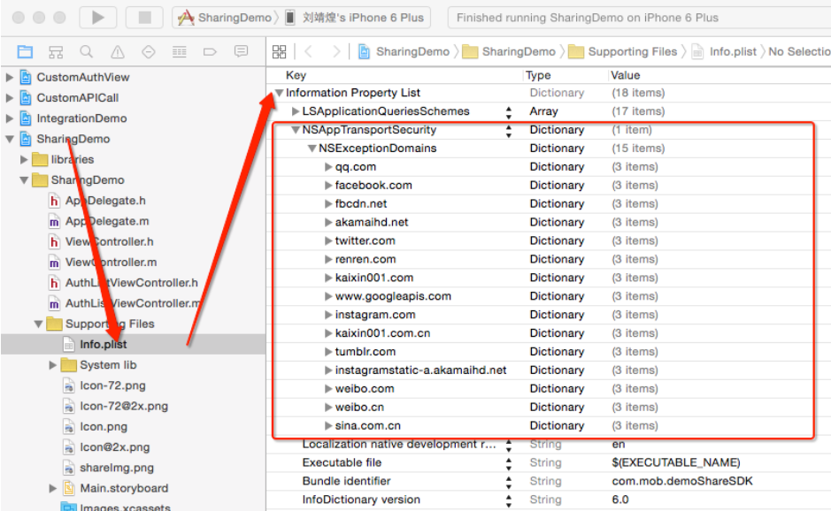

<div style="margin: 1em 0px 16px; padding: 0px 0px 0.3em; color: rgb(133, 195, 155); line-height: 1.225; font-size: 1.75em; border-bottom-width: 1px; border-bottom-style: solid; border-bottom-color: rgb(133, 133, 133);"> iOS 开发问与答（FAQ）</div>

##1.集成SQLite.swift框架出错:“sqlite3.h not found”

由于Xcode编译SDK时，模块映射只能使用绝对路径而不能使用相对路径，所以Xcode.app的路径在module.modulemap中被写死了。在module.modulemap文件中，将Xcode.app安装路径改变成你的Xcode安装路径，比如：

```swift
/Applications/Xcode6.4.app/Contents/Developer/Platforms/iPhoneOS.platform/Developer/SDKs/iPhoneOS.sdk/usr/include/sqlite3.h
```

注意，这里使用的是Xcode6.4.app文件名，而不是默认的Xcode.app文件名。

Clean,重新编译。

##2.如何新建一个故事板，并改变故事板中的创建的ViewController的默认大小为iPhone/iPad？

新建storyboard文件，打开File面板，去掉“Use Size Classes”选项，Xcode会问你是否保留iPhone/iPad的Size类，选择一个类别（iPhone或iPad），然后点击”Disable Size Classes”按钮。这样，故事板中的view的大小将使用选定设备的屏幕大小。

##3.如何修改Statusbar的背景色

首先确保Info.plist中View controller-based status bar appearance一项为NO。
在viewcontroller中新加代码：
```swift
override func preferredStatusBarStyle() -> UIStatusBarStyle {
	return UIStatusBarStyle.LightContent
}
```
实现如下方法并在viewDidLoad方法中调用它：
```swift
func addStatusBarBgColor(color:UIColor){
	let view=UIView(frame: CGRectMake(0, 0,UIScreen.mainScreen().bounds.size.width, 20))
	view.backgroundColor=color
	self.view.insertSubview(view, atIndex: 0)
}
```

##4.如何修改Toolbar的背景色
首先确保Toolbar的Trancent一项未勾上。
然后实现如下方法并在viewDidLoad方法中调用它：
```swift
func addToolbarBgColor(color:UIColor,toolbar:UIToolbar){
	let view=UIView(frame: toolbar.bounds)
	view.backgroundColor=color
	toolbar.insertSubview(view, atIndex: 0)
}
```

##5.如何将Dictionary转换成SwiftyJSON中的JSON对象？

```swift
func dic2json(d:Dictionary<String,AnyObject>)->JSON?{
    var error:NSError?;
    if let data = NSJSONSerialization.dataWithJSONObject(d, options: NSJSONWritingOptions.PrettyPrinted, error: &error) {
        return JSON(data: data, options: NSJSONReadingOptions.MutableContainers, error: nil)
    }
    println("Object convert JSON error:\(error)")
    return nil
}

```
##6.在故事板中，无法为UIButton创建IBAction连接

原因在于某个对UIButton的扩展中将IButton定义为

```swift
extension UIButton : DynamicTypeChangeHandler {
```
将其注释即可。

##7.如何去除Toolbar上方的细线？
```swift
toobar.clipsToBounds = YES
```
细线即被清除

##8.当使用setTitle:forState:方法改变按钮标题时，会有一个FadeInOut动画效果，导致文字闪烁？
将按钮设置为 UIButtonTypeCustom，可以消除闪烁。

##9.移除字符串最后一个字符

```swift
if str.hasSuffix(",") {
	str.removeAtIndex(str.endIndex.predecessor())
}
```
##10.有时候 NSLocalizedStringFromTable 不生效

假设你有一个 .strings 进行了本地化，但你发现 NSLocalizedStringFromTable 方法根本取不到任何本地字符串（甚至 en 字符串也取不到，只返回 key 值）。那么你可以 Clean 一下再编译。

如果在模拟器上测试，可以编辑 Scheme ，将 Run /option 下的 applicaton language和 application region 两项修改为中文/中国进行测试。

##11.如何让 Xcode 加载 JPG 文件？
从 Xcode 6.1 开始，JPG 图像可以放进 asset catalog(资源目录) 中了。但是当你这样做的时候，图片却只会显示为空白，同时控制台报一个错误：
Could not load the "abc.png" image referenced from a nib in the bundle with identifier "xxx"。

包含JPG文件的 Image Set 的 Render As 属性（在属性面板中）修改为 Original Image 即可。
注：编译过后，你又可以将 Render As 属性修改为 Default。但是当你 Clean 以后又不行了（必须重新改为 Original Image）。

##12.怎样在一个 NSLayoutConstraint 上执行动画？
因为布局约束修改之后并不会导致立即重新计算自动布局。所以在动画块中修改NSLayoutConstraint不会导致UIView显示动画。
所以，当你修改完约束的constant之后，应该使用layoutIfNeeded()方法强制让布局引擎重新计算view的布局：
```swift
UIView.animateWithDuration(0.5, delay: 0, options: UIViewAnimationOptions.CurveEaseOut, animations: { () -> Void in
		[self]
		self.locationTop.constant = self.locationIsShow ? -42 : -2
    	self.view.layoutIfNeeded()
	}, completion: { (stop) -> Void in
		self.locationIsShow = !self.locationIsShow
	})
```

##13.如何让工具栏的左按钮放在正确的位置？

默认工具栏（或导航栏）左按钮的位置会距离工具栏left约12px左右的位置。如果你想让左按钮从工具栏的 0,0位置开始，可以在左按钮前端插入一个 Fixed Space Bar Button Item，并将它的 width 设置为 0（如果要更靠左一些，可以将width设置为负值）


##14.为什么多行文本框中的文本会从文本框下移一段位置开始？

如下图所示：

因为导航栏的原因，光标和文本默认会下移64个像素。解决办法，在viewDidLoad 方法中，加入代码：

```swift
if self.respondsToSelector("edgesForExtendedLayout"){// iOS 7+
	self.edgesForExtendedLayout=UIRectEdge.None
}
```

##15.为什么 Scroll Direction 设置为 Horizontal 后 UICollectionViewCell 仍然会纵向排列（换行）？

如下图所示：

这是因为 Cell 的高度不足以占据屏幕的高度。在故事板中，将 UICollectionView 的 Cell Size 设置为一个比较高的高度，比如：225x400。效果如下：


##16.如何一次性删除表格中所有单元格？

```swift
        var allIndexPath = [NSIndexPath]()
        let nSections = tableView.numberOfSections()
        for j in 0 ..< nSections {
            let nRows = tableView.numberOfRowsInSection(j)
            for i in 0 ..< nRows {
                let indexPath = NSIndexPath(forRow: i, inSection: j)
                allIndexPath.append(indexPath)
            }
        }
        tableView.beginUpdates()
        tableView.deleteRowsAtIndexPaths(allIndexPath, withRowAnimation: UITableViewRowAnimation.None)
        tableView.endUpdates()
```
要获得所有当前可见的 Cell，使用：

```swift
let indexPaths = tableView.indexPathsForVisibleRows()
```

##17.如何将 swift 代码导入到 O-C？
在O-C 文件中使用 import "项目名称-Swift.h" 语句。其中“项目名称”是你的项目名称，例如：#import "ProductName-Swift.h"。
这个文件是 Xcode 自动生成的，它把项目中所有的 Swift 类的接口文件都定义到这个文件中了。注意这些类必须是用 @objc 声明或者继承了 NSObject 的 swift 类。

##18.iOS 中有类似于 Java 中的 Synchroized() 的语句吗？
在多线程操作中，经常要保护某一语句块让它同步执行，iOS 中也有类似 Java 的 Synchronized() 语句。要向同步执行语句，将要同步执行的语句包裹在 objc_sync_enter()/objc_sync_exit() 中即可：

```swift
// 同步块，防止打印异常
objc_sync_enter(self)
let progress: NSProgress = object as! NSProgress
println("progress:\(progress.fractionCompleted)")
objc_sync_exit(self)
```

##19.如何获取生产环境的 Device Token？
在沙盒环境，我们可以将 device token 打印到控制台，从而获得 device token。但更换到生产环境（production）后就没有这么方便了。如果想获得生产环境的 device token，可以依照以下步骤：

1. 打开以下 url: [http://developer.apple.com/library/ios/#technotes/tn2265/_index.html](http://developer.apple.com/library/ios/#technotes/tn2265/_index.html)
2. 在页面右上角，有一个 Companion File 连接，点击以下载 Companion File 文件。下载后得到一个 tn2265_PersistentConnectionLogging.zip 文件。
3. 解压缩，获得一个 PersistentConnectionLogging.mobileconfig 文件。将它以附件的方式发送给自己的邮箱。
4. 在设备上，用系统的“邮件”程序打开这个邮件（注意必须是系统的邮件程序，不能是“邮箱大师”等第三方邮件客户端）。
5. 点击附件中的 PersistentConnectionLogging.mobileconfig 文件，这将在设备上安装一个 APS/PC Logging 描述文件。在安装过程中，需要输入锁屏密码。
6. 安装完毕，重启设备。
7. 在 Xcode 中，打开 Window/Devices，查看设备的控制台日志，可以看到类似 handleReceivedPublicToken:<282aae5d 52978299 134078ed 2702ea16 ddfbd208 10d6fb01 9353c601 4ad773e4> 的字样，这个就是设备的 device token（将空格删除）。

##20.如何校验服务器PUSH证书是否有效？

判断 cer 格式的PUSH证书是否有效非常简单，使用 PushMeBaby\SmartPush 之类的 Mac 应用程序向设备推一条推送通知就可以了。
但是服务器使用的PUSH 证书往往是 .pem（PHP/GoLang服务端）或 .p12(Java/C#服务端)格式的，我们可以用以下 OpenSSL 命令判断服务器 PUSH 证书是否有效，然后再确定是否是服务端代码的问题：

1. 将 PKCS#12 (.pfx .p12) 转成 PEM：

	用以下命令转换成同时包含私钥和证书的 pem 文件：
	
	```
	openssl pkcs12 -in apns_production_privatekey.p12 -out apns_production_privatekey.pem -nodes
	
	```
	期间会提示输入密码，请输入 p12 文件导出时的密码。
	
	> 注意：如果只导出私钥可以加上 -nocerts 参数，只导出证书则可以加上 -nokeys 参数。

2. 测试生产证书：

	```
	openssl s_client -connect gateway.push.apple.com:2195 -cert apns_production_privatekey.pem
	
	```
	如果输出如下信息（），表明证书是正常的：
	

> 	CONNECTED(00000003) depth=1 /C=US/O=Entrust,
> Inc./OU=www.entrust.net/rpa is incorporated by reference/OU=(c) 2009
> Entrust, Inc./CN=Entrust Certification Authority - L1C verify
> error:num=20:unable to get local issuer certificate verify return:0
> --- Certificate chain  0 s:/C=US/ST=California/L=Cupertino/O=Apple Inc./CN=gateway.push.apple.com    i:/C=US/O=Entrust,
> Inc./OU=www.entrust.net/rpa is incorporated by reference/OU=(c) 2009
> Entrust, Inc./CN=Entrust Certification Authority - L1C  1
> s:/C=US/O=Entrust, Inc./OU=www.entrust.net/rpa is incorporated by
> reference/OU=(c) 2009 Entrust, Inc./CN=Entrust Certification Authority
> - L1C    i:/O=Entrust.net/OU=www.entrust.net/CPS_2048 incorp. by ref. (limits liab.)/OU=(c) 1999 Entrust.net Limited/CN=Entrust.net
> Certification Authority (2048)
> --- Server certificate
> -----BEGIN CERTIFICATE----- MIIFIzCCBAugAwIBAgIETCMvvjANBgkqhkiG9w0BAQUFADCBsTELMAkGA1UEBhMC ...
> ... de7tGJEmdBgmtX2Wn0r0Erg+9nnjOEQ=
> -----END CERTIFICATE----- subject=/C=US/ST=California/L=Cupertino/O=Apple
> Inc./CN=gateway.push.apple.com issuer=/C=US/O=Entrust,
> Inc./OU=www.entrust.net/rpa is incorporated by reference/OU=(c) 2009
> Entrust, Inc./CN=Entrust Certification Authority - L1C
> --- Acceptable client certificate CA names /C=US/O=Apple Inc./OU=Apple Certification Authority/CN=Apple Root CA /C=US/O=Apple Inc./OU=Apple
> Worldwide Developer Relations/CN=Apple Worldwide Developer Relations
> Certification Authority /C=US/O=Apple Inc./OU=Apple Certification
> Authority/CN=Apple Application Integration Certification Authority
> --- SSL handshake has read 3144 bytes and written 2168 bytes
> --- New, TLSv1/SSLv3, Cipher is AES256-SHA Server public key is 2048 bit Secure Renegotiation IS supported Compression: NONE Expansion:
> NONE SSL-Session:
>     Protocol  : TLSv1
>     Cipher    : AES256-SHA
>     Session-ID: 
>     Session-ID-ctx: 
>     Master-Key: 9E737F1BD1AC1D41A2D6486B9F2DD08EF3B87EC9A91EBB42396D9664B34FF534DA2DCF4A897688ECBEFE00B069C481BC
>     Key-Arg   : None
>     Start Time: 1452222166
>     Timeout   : 300 (sec)
>     Verify return code: 0 (ok)

##21.如何向设备中写入/读出应用日志？
在 Xcode 中调试 App 时，当我们使用 NSLog、printf 语句时，可以向控制台打印一些信息。
如果 App 是以 release 的方式安装（无论以何种方式：App Store、Ad-Hoc 或者 OTA）到设备上，则只有 NSLog 语句打印的信息能够通过 Xcode 的 Devices 进行查看。
如果没有安装 Xcode，则可以通过 iTunes 的文件共享功能查看控制台日子，方法如下（只能查看 NSLog 输出的日志）。

1. 在 App 的 info.plist 中增加一个 Application supports iTunes file sharing 为 true 的键。
2. 在 application(_, didFinishLaunchingWithOptions:) 方法中加入代码：

	```swift
	let documents = NSHomeDirectory().stringByAppendingPathComponent("Documents")
    
    let logFileName = "\(NSDate()).log"
    
    let logFilePath = documents.stringByAppendingPathComponent(logFileName)
    
    freopen(logFilePath.cStringUsingEncoding(NSASCIIStringEncoding)!, "a+", stderr)
	```
	
3. 打开 iTunes，连上设备，通过“应用 / 文件共享”将日志文件下载到 Mac。

##22.为什么我的 App 在 iOS 8 中可以但在 iOS 9 中却不可以使用定位服务？

在 iOS 9.x 的“设置>定位服务”中，甚至看不到 App 的名字。奇怪的是，在 iOS 8 中却正常。这是因为代码中的 requestAlwaysAuthorization/requestWhenInUseAuthorization 方法和 Info.plist 中的 NSLocationAlwaysUsageDescription/NSLocationWhenInUseUsageDescription 不对应。例如，在代码中使用的是 requestAlwaysAuthorization（总是使用定位服务，哪怕在后台），而 Info.plist 中却只声明了 NSLocationWhenInUseUsageDescription（只有 App 在前台时才使用定位服务），没声明 NSLocationAlwaysUsageDescription 字串。
所以最好是在 Info.plist 文件中同时声明 NSLocationAlwaysUsageDescription 和 NSLocationWhenInUseUsageDescription 字串，这样无论调用的是 requestAlwaysAuthorization 还是 requestWhenInUseAuthorization 方法，都不会出错。

##23.为什么 presentOpenInMenuFromXXX 方法在 iOS 9 中不能显示菜单？

iOS 8下没有问题。在 iOS 9 中，用 presentOptionsMenuFromXXX 方法代替。

##24.将一个 TabBarController 嵌入到 NavigationController 后，setTitle 无法设置导航栏标题。

这种情况下，必须用 self.tabBarController?.title="xxx" 来修改导航栏标题。
同理，要修改右按钮使用 :
```swift
self.tabBarController?.navigationItem.rightBarButtonItem=UIBarButtonItem(customView: btn)
```
##25.在模拟器（iOS 9）中调试 MapKit 时，出现“Error Domain=kCLErrorDomain Code=2 "(null)"

Product -> Scheme -> Edit Scheme -> Options 中，勾选 Allow Location Simulation ，同时在这里提供一个模拟器坐标，不能是 "none"。


##26.如何在多个 ViewController 中共用一个模板单元格


1. 新建一个空的 xib 文件：CustomCell.xib。
2. 从故事板中将要共享的模板单元格拷贝到 xib 文件的根下（顶级元素）。
3. 删除故事板中原来的模板单元格（因为我们不需要它了）。
4. 在要用到这个单元格的 ViewController 中，在 viewDidLoad 方法（或者别的什么地方）中加入：

	self.tableView.registerNib(UINib(nibName: "CustomCell", bundle: NSBundle.mainBundle()), forCellReuseIdentifier: "CustomCellIdentifier")
5. 然后在 tableView(_, cellForRowAtIndexPath:) 方法中：

	let cell = tableView.dequeueReusableCellWithIdentifier("CustomCellIdentifier") as! CustomCell
	
##27.Xcode 打包错误: Missing IOS Distribution Signing Identity
Apple WWDR 证书过期（2016年2月15日过期）。

1. 下载 https://developer.apple.com/certificationauthority/AppleWWDRCA.cer
2. 双击下载的 WWDR 证书，将它安装到 Keychain
3. 在 Keychain 中，选择 视图 -> "显示已过期的证书" 
4. 在 Keychain 中，选择“证书”（注意，不是“我的证书”），找到过期的那个 "Apple Worldwide Developer Relations Certificate Authority certificates" 并删除（包括“登录”和“系统两个账号中的都要删除）。
5. 重新 Archive

##28.LocalSubstitionCache 不生效

AMapLocation 和 LocalSubstitutionCache 有冲突，无法和后者同时使用。将 AMapLocation 换成苹果的 CoreLocation 即可。

##29.如何将按钮图标置于按钮文本的右侧？
正常情况下，按钮图片（ImageView）位于按钮文本（titleLabel）的左侧。要将二者左右交换，有以下几种方法。其中，最简单的是第一个方法：

```swift
func flipButtonTitleImage(button:UIButton){// 将按钮图标置于文本右侧
    button.transform = CGAffineTransformMakeScale(-1.0, 1.0);
    button.titleLabel!.transform = CGAffineTransformMakeScale(-1.0, 1.0);
    button.imageView?.transform = CGAffineTransformMakeScale(-1.0, 1.0);
}
```
或者修改二者的 Insets：

```objective-c
thebutton.titleEdgeInsets = UIEdgeInsetsMake(0, -thebutton.imageView.frame.size.width, 0, thebutton.imageView.frame.size.width);
thebutton.imageEdgeInsets = UIEdgeInsetsMake(0, thebutton.titleLabel.frame.size.width, 0, -thebutton.titleLabel.frame.size.width);
```
或者子类化 UIButton 并覆盖这两个方法：

```objective-c
@implementation UIButtonSubclass

- (CGRect)imageRectForContentRect:(CGRect)contentRect
{
    CGRect frame = [super imageRectForContentRect:contentRect];
    frame.origin.x = CGRectGetMaxX(contentRect) - CGRectGetWidth(frame) -  self.imageEdgeInsets.right + self.imageEdgeInsets.left;
    return frame;
}

- (CGRect)titleRectForContentRect:(CGRect)contentRect
{
    CGRect frame = [super titleRectForContentRect:contentRect];
    frame.origin.x = CGRectGetMinX(frame) - CGRectGetWidth([self imageRectForContentRect:contentRect]);
    return frame;
}

@end
```
当然，最简单的还是第一个方法。

##30.如何定制 JSQMessagesLoadEarlierHeaderView？
默认 JSQMessagesLoadEarlierHeaderView 显示一个按钮，标题为“Load Earlier Messages”。我们可以修改这个按钮，让它显示“加载更多历史消息”，如下图所示。

在 JSQMessagesViewController 子类中实现这个方法：

```swift
// 数据源方法：设置除了 cell 之外的 View，比如 HeaderView
- (UICollectionReusableView *)collectionView:(JSQMessagesCollectionView *)collectionView
           viewForSupplementaryElementOfKind:(NSString *)kind
                                 atIndexPath:(NSIndexPath *)indexPath
{
    if (self.showLoadEarlierMessagesHeader && [kind isEqualToString:UICollectionElementKindSectionHeader]) {// 如果是 JSQMessagesLoadEarlierHeaderView
        JSQMessagesLoadEarlierHeaderView *header = [collectionView dequeueLoadEarlierMessagesViewHeaderForIndexPath:indexPath];
        
        // Customize header
        [header.loadButton setTitle:@"加载更多历史消息" forState:UIControlStateNormal];
        
        return header;
    }
    
    return [super collectionView:collectionView
viewForSupplementaryElementOfKind:kind
                     atIndexPath:indexPath];
}
```
##31.如何定制 JSQMessagesToolbarContentView
在左边 voice 按钮前加入一个 add 按钮：

```swift
UIButton *btn=[UIButton buttonWithType:UIButtonTypeContactAdd];
JSQMessagesToolbarContentView *contentView= self.inputToolbar.contentView;
[contentView.leftBarButtonContainerView addSubview:btn];//add the new button

contentView.leftBarButtonItemWidth=66; //make containerView wider to hold more buttons
//remove unused leftBarButtonItem constraint
for (NSLayoutConstraint *constraint in contentView.leftBarButtonItem.superview.constraints) {
    if(constraint.secondItem ==contentView.leftBarButtonItem &&constraint.firstAttribute ==NSLayoutAttributeLeading){
        constraint.active=NO;
    }
}
// update two button constraint
[contentView.leftBarButtonItem mas_makeConstraints:^(MASConstraintMaker *make) {
    make.width.equalTo(@30);
}];

[btn mas_makeConstraints:^(MASConstraintMaker *make) {
    make.top.equalTo(btn.superview.mas_top);
    make.bottom.equalTo(btn.superview.mas_bottom);
    make.left.equalTo(btn.mas_left);
    make.width.equalTo(@30);
}];
```

在右边 send 按钮前加入一个 add 按钮：

```swift
-(void)customInputToolbar{
    UIButton *btn=[UIButton buttonWithType:UIButtonTypeContactAdd];
    JSQMessagesToolbarContentView *contentView= self.inputToolbar.contentView;
    [contentView.rightBarButtonContainerView addSubview:btn];//add the new button
    
    contentView.rightBarButtonItemWidth=76; //make containerView wider to hold more buttons
    //remove unused rightBarButtonItem constraint
    for (NSLayoutConstraint *constraint in contentView.rightBarButtonItem.superview.constraints) {
        if(constraint.secondItem ==contentView.rightBarButtonItem &&constraint.firstAttribute ==NSLayoutAttributeLeading){
            constraint.active=NO;
        }
    }
    // update two button constraint
    [contentView.rightBarButtonItem mas_makeConstraints:^(MASConstraintMaker *make) {
        make.width.equalTo(@40);
    }];
    
    [btn mas_makeConstraints:^(MASConstraintMaker *make) {
        make.top.equalTo(btn.superview.mas_top);
        make.bottom.equalTo(btn.superview.mas_bottom);
        make.right.equalTo(contentView.rightBarButtonItem.mas_left);
        make.width.equalTo(@30);
    }];
    
    [btn addTarget:self action:@selector(addAction:) forControlEvents:UIControlEventTouchUpInside];
    
    // 设置 voice 按钮和 send 按钮
    [contentView.leftBarButtonItem setImage:[UIImage imageNamed:@"chat_bottom_voice_press"] forState:UIControlStateNormal];
    [contentView.leftBarButtonItem setImage:[UIImage imageNamed:@"chat_bottom_voice_nor"] forState:UIControlStateHighlighted];
    
    [contentView.rightBarButtonItem setTitle:@"发送" forState:UIControlStateNormal];
    
}
```


##32.如何判断 TextView 中回车键按下？
如果是 UITextField，可以用 textFieldShouldReturn(\_) 委托方法。但 UITextView 中却没有类似的委托方法，因此只能用 textView(\_, shouldChangeTextInRange:, replacementText:) 方法替代：

```swift
func textView(textView: UITextView, shouldChangeTextInRange range: NSRange, replacementText text: String) -> Bool {
        if text == "\n" {
            if !textView.text.isEmpty {
                textView.resignFirstResponder()
                ... ... // 回车键按下，进行相应处理
            }
            return false;
        }
        return true;
    }
```
O-C 代码：

```swift
- (BOOL)textView:(UITextView *)textView shouldChangeTextInRange:(NSRange)range replacementText:(NSString *)text {
    
    if([text isEqualToString:@"\n"]) {
        if( [textView.text length]>0){
            [textView resignFirstResponder];
            ... ... // 回车键按下，进行相应处理
        }
        return NO;
    }
    
    return YES;
}
```
##33. 如何检测 UITextView 的 contentSize 被改变？
contentSize 随着输入内容改变。如果你需要知道 UITextView 的 contentSize 何时变化时，使用如下方法。
首先，添加键值观察：

```swift
[self.inputToolbar.contentView.textView addObserver:self
                                             forKeyPath:NSStringFromSelector(@selector(contentSize))
                                                options:NSKeyValueObservingOptionOld | NSKeyValueObservingOptionNew
                                                context:NULL];
```
然后实现 observeValueForKeyPath 方法，检测 contentSize 变化：

```swift
- (void)observeValueForKeyPath:(NSString *)keyPath ofObject:(id)object change:(NSDictionary *)change context:(void *)context
{
    if (object == self.inputToolbar.contentView.textView
            && [keyPath isEqualToString:NSStringFromSelector(@selector(contentSize))]) {

            CGSize oldContentSize = [[change objectForKey:NSKeyValueChangeOldKey] CGSizeValue];
            CGSize newContentSize = [[change objectForKey:NSKeyValueChangeNewKey] CGSizeValue];

            CGFloat dy = newContentSize.height - oldContentSize.height;

            [self jsq_adjustInputToolbarForComposerTextViewContentSizeChange:dy];
            [self jsq_updateCollectionViewInsets];
            if (self.automaticallyScrollsToMostRecentMessage) {
                [self scrollToBottomAnimated:NO];
            }
        }
}
```
但是，UIKit 中的 KVO 兼容并不是非常可靠，特别在 iOS 9 中。替代的方案是子类化 UITextView 并覆盖 setContentSize 方法。

##34. 第三方库编译出现错误“Too many arguments to function call,expected 0,have 3”

例如，编译 nimbus 库时， NIButtonUtilities.m 中的 method(: : :)方法调用出现编译错误：Too many arguments to function call,expected 0,have 3

根据 2014 WWDC 视频中 Session 417 "What's New in LLVM" 所述，编译器会强制要求对 objc_msgSend 使用强类型声明。例如：
	
```swift
typedef void (*send_type)(void*, SEL, void*);
send_type func = (send_type)objc_msgSend;
func(anItem.callback_object, NSSelectorFromString(anItem.selector), dict);
```
注意 sent_type 的使用。现在 objc_msgSend 变成了一个强类型。如果是调用实例方法，也是同样：
	
```swift
typedef void (*send_type)(void*, SEL, void*);
send_type methodInstance = (send_type)[SomeClass instanceMethodForSelector:someSelector];
methodInstance(self, someSelector, someArgument);
```
注意定义 send_type 类型时，返回值不一定是 void，你可以根据需要进行修改。
如果不想修改源代码，则可以修改编译选项，将编译器的这个特性关掉。在 targets 中找到 NimBus，进入 Build Settings，搜索 Enable strict checking of objc_msgsend calls，设置为 NO。
	
##35. 在 lldb 中如何打印 indexPath.row?

当我们使用 lldb 命令 p indexPath.row 时，总是报错：error: property 'row' not found on object of type 'NSIndexPath *'

其实，只需要换成如下命令即可：

```
(lldb) p (NSInteger)[indexPath section]
(NSInteger) $15 = 0
```

##36. 如何用 CocoaHttpServer 实现一个 https 服务器？
继承 HTTPConnection 类：

```swift
@interface MyHTTPConnection : HTTPConnection
```
在 `HTTPConnection` 子类中，实现 - (BOOL)isSecureServer 方法并返回 YES，表示支持 https。

制作一个 SSL 自签名证书（见问题 ##37），安装到钥匙串，然后导出为 .p12 文件，记住导出密码。

制作证书时需要注意 /CN 参数必须指定主机名，比如 /CN 参数指定为 127.0.0.1，则访问时只能用 https://127.0.0.1，而不能用 https://localhost 替代。

实现 sslIdentityAndCertificates 方法：

```swfit
- (NSArray *)sslIdentityAndCertificates
{
    SecIdentityRef identityRef = NULL;
    SecCertificateRef certificateRef = NULL;
    SecTrustRef trustRef = NULL;
    
    NSString *thePath = [[NSBundle mainBundle] pathForResource:@"127.0.0.1" ofType:@"p12"];
    NSData *PKCS12Data = [[NSData alloc] initWithContentsOfFile:thePath];
    CFDataRef inPKCS12Data = (__bridge CFDataRef)PKCS12Data;
    CFStringRef password = CFSTR("你导出 .p12 的密码");
    const void *keys[] = { kSecImportExportPassphrase };
    const void *values[] = { password };
    CFDictionaryRef optionsDictionary = CFDictionaryCreate(NULL, keys, values, 1, NULL, NULL);
    CFArrayRef items = CFArrayCreate(NULL, 0, 0, NULL);
    
    OSStatus securityError = errSecSuccess;
    securityError =  SecPKCS12Import(inPKCS12Data, optionsDictionary, &items);
    if (securityError == 0) {
        CFDictionaryRef myIdentityAndTrust = CFArrayGetValueAtIndex (items, 0);
        const void *tempIdentity = NULL;
        tempIdentity = CFDictionaryGetValue (myIdentityAndTrust, kSecImportItemIdentity);
        identityRef = (SecIdentityRef)tempIdentity;
        const void *tempTrust = NULL;
        tempTrust = CFDictionaryGetValue (myIdentityAndTrust, kSecImportItemTrust);
        trustRef = (SecTrustRef)tempTrust;
    } else {
        NSLog(@"Failed with error code %d",(int)securityError);
        return nil;
    }
    
    SecIdentityCopyCertificate(identityRef, &certificateRef);
    NSArray *result = [[NSArray alloc] initWithObjects:(__bridge id)identityRef, (__bridge id)certificateRef, nil];
    
    return result;
}
```
复制 HTTPConnetion.m 中的 startConnection 方法和 startReadingRequest 方法代码。
找到 startConnection 方法中如下语句：

```swift
[settings setObject:(NSString *)kCFStreamSocketSecurityLevelNegotiatedSSL	                         forKey:(NSString *)kCFStreamSSLLevel]
```

替换为：

```swift
[settings setObject:[NSNumber numberWithInteger:2] forKey:GCDAsyncSocketSSLProtocolVersionMin];
[settings setObject:[NSNumber numberWithInteger:2] forKey:GCDAsyncSocketSSLProtocolVersionMax];
```
在启动 HTTPServer （调用 startServer ）之前，使用 setConnectionClass 方法将 HTTPConnecdtion 替换为 MyHTTPConnection：

```swift
[httpServer setConnectionClass:[MyHTTPConnection class]];
```
##37 如何制作 SSL 自签名证书？

```
1. CA 私钥

openssl genrsa -out myCA.key 2048

2. CA 证书

openssl req -x509 -new -key myCA.key -out myCA.cer -days 35600 -subj /CN="Yunnan Yuan Xin"

3. SSL 证书私钥

openssl genrsa -out myserver.key 2048

4. CSR

openssl req -new -out sslcert.req -key myserver.key -subj /CN=127.0.0.1

5. ssl 证书

openssl x509 -req -in sslcert.req -out sslcert.cer -CAkey myCA.key -CA myCA.cer -days 36500 -CAcreateserial -CAserial serial

6. 合并私钥及证书

openssl pkcs12 -export -out sslcert.pfx -inkey myserver.key -in sslcert.cer
```
##38. 实现本地 HTTPs 服务器后，在 iOS 9 上无法访问

这是 iOS 9 上 App Transport Security 相关错误之一，iOS 9 以前没有这个问题。查看设备日志，发现错误 CFNetwork SSLHandshake failed (-9801)。
原因是服务器上的 TSL 版本低于 TSLv1.2。在 HTTPConnection 子类的 startConnection 方法中，将：

```swift

[settings setObject:(NSString *)kCFStreamSocketSecurityLevelNegotiatedSSL
               forKey:(NSString *)kCFStreamSSLLevel];
```

替换为：

```swift
[settings setObject:[NSNumber numberWithInteger:kTLSProtocol12] forKey:GCDAsyncSocketSSLProtocolVersionMin];
            [settings setObject:[NSNumber numberWithInteger:kTLSProtocol12] forKey:GCDAsyncSocketSSLProtocolVersionMax];
```
或者在 Info.plist 中设置：

```xml
<key>NSAppTransportSecurity</key>
	<dict>
		<key>NSAllowsArbitraryLoads</key>
		<true/>
        <key>localhost</key>
        <dict>
            <key>NSIncludesSubdomains</key>
            <true/>
            <key>NSTemporaryExceptionAllowsInsecureHTTPLoads</key>
            <true/>
            <key>NSTemporaryExceptionMinimumTLSVersion</key>
            <string>TLSv1.0</string>
            <key>NSTemporaryExceptionRequiresForwardSecrecy</key>
            <false/>
            <key>NSThirdPartyExceptionAllowsInsecureHTTPLoads</key>
            <false/>
            <key>NSThirdPartyExceptionRequiresForwardSecrecy</key>
            <true/>
            <key>NSThirdPartyExceptionMinimumTLSVersion</key>
            <string>服务器的TSL/SSL协议版本</string><!-- 或者 SSLv3.0、TLSv1.0、TLSv1.1 等-->
            <key>NSRequiresCertificateTransparency</key>
            <false/>
        </dict>
	</dict>
```
> 注意，这里“服务器的TSL/SSL协议版本”要替换成服务器真正的 TSL/SSL 版本，比如 SSLv3.0、TLSv1.0、TLSv1.1。

##39. 定制 cell 的 Edit View

1. 实现数据源方法 canEditRowAtIndexPath ，并根据 IndexPath 返回一个 Bool 值——YES 表示支持滑动操作，NO 表示不支持。
2. 实现数据源方法 commitEditingStyle 。空实现，不需要编写任何代码。
3. 实现委托方法 editActionsForRowAtIndexPath：

```swift
-(NSArray *)tableView:(UITableView *)tableView editActionsForRowAtIndexPath:(NSIndexPath *)indexPath {

       UITableViewRowAction *editAction = [UITableViewRowAction rowActionWithStyle:UITableViewRowActionStyleNormal title:@"Clona" handler:^(UITableViewRowAction *action, NSIndexPath *indexPath){
          //insert your editAction here
       }];
       editAction.backgroundColor = [UIColor blueColor];

       UITableViewRowAction *deleteAction = [UITableViewRowAction rowActionWithStyle:UITableViewRowActionStyleNormal title:@"Delete"  handler:^(UITableViewRowAction *action, NSIndexPath *indexPath){
          //insert your deleteAction here
       }];
       deleteAction.backgroundColor = [UIColor redColor];
		return @[deleteAction,editAction];
}
```

##40. iOS 9 中添加 http 请求白名单

iOS 9 下，默认不再支持 http 类型的网络请求（强制要求 https），如果在代码中发出 http 请求，iOS 会报如下错误：

App Transport Security has blocked a cleartext HTTP (http://) resource load since it is insecure. Temporary exceptions can be configured via your app's Info.plist file.

我们需要让 iOS 9 支持 http 协议请求，或者将要访问的 http 网址添加到 “白名单” 中。

方法一. 在项目的info.plist中添加一个Key：NSAppTransportSecurity，类型为字典类型。

然后给它添加一个Key：NSAllowsArbitraryLoads，类型为Boolean类型，值为YES；


方法二. 
1）、在项目的info.plist中添加一个Key：NSAppTransportSecurity，类型为字典类型。

2）、然后给它添加一个NSExceptionDomains，类型为字典类型；

3）、把需要的支持的域添加給NSExceptionDomains。其中域作为Key，类型为字典类型。

4）、每个域下面需要设置3个属性：NSIncludesSubdomains、NSExceptionRequiresForwardSecrecy、NSExceptionAllowsInsecureHTTPLoads。

均为Boolean类型，值分别为YES、NO、YES。



##41.当收到推送通知时， didReceiveRemoteNotification 方法不调用

在实现推送通知时，实现了 didReceiveRemoteNotification 和 didReceiveRemoteNotification:fetchCompletionHandler 方法，但这些方法只会在 App 从后台被唤醒时触发。也就说当 Push 通知到达，用户从通知中心点击消息，系统唤醒 App 后才会触发这些方法。

如果想在 App 处于后台时就调用这些方法，需要使用“静默的推送通知”：

1. 打开后台运行选项中的 Remote notifications：

	
	
2. 在通知载体中添加 content-available 键：

	```
	{
    aps = {
        "content-available" : 1,
        sound : ""
    };
	}
	```
	
##42.接收到推送通知时，如何更新 Badge 数？

一般情况下，通知未读数由服务端维护。当服务器发送一个远程通知到某台设备时，同时会在载体中附加 badge 数。当设备收到通知后，App 如果处于后台或退出状态，OS 会自动更新 App 图标上的 badge 数。一旦 App 再次处于运行状态，就可以通过 application:didReceiveRemoteNotification: 方法获取读取远程通知，并从 userInfo 参数中获得 bdge 数。这时你可以更新 badge 数。

```swift
if (userInfo) {
        NSLog(@"%@",userInfo);

        if ([userInfo objectForKey:@"aps"]) { 
            if([[userInfo objectForKey:@"aps"] objectForKey:@"badgecount"]) {
                [UIApplication sharedApplication].applicationIconBadgeNumber = [[[userInfo objectForKey:@"aps"] objectForKey: @"badgecount"] intValue];
            }
        }
    }
```
> 注意，在消息载体中 badge 字段要用数字而不是字符串。例如：
> {"aps":{"alert":"Hello from APNs Tester.","badge":1}}

##43.为什么收到推送通知时，不会播放声音？

要在消息载体中指定 sound 字段。例如：

```
{"aps":{"alert":"Hello from APNs Tester.","badge":1,sound:"default"}}
```
"sound":"default"，播放系统默认的声音。

##44.如何在消息载体中指定自定义的声音？
```
{"aps":{"alert":"Hello from APNs Tester.","badge":1,"sound":"alarm"}}
```
其中 alarm 是声音文件的文件名（不需要扩展名）。声音文件必须位于 bundle 或者 Library/Sounds 目录，文件类型必须是 aiff, wav, 或 caf。如果指定的文件不存在，系统用默认声音（default）替代。

##45.如何读取系统声音？
系统声音放在了 /System/Library/Audio/UISounds 目录，你可以将系统声音拷贝到 App 的 Library/Sounds 目录：

```swift
NSArray* loadAudioList(){
    NSMutableArray *audioFileList = [[NSMutableArray alloc] init];
    
    NSFileManager *fileManager = [[NSFileManager alloc] init];
    NSURL *directoryURL = [NSURL URLWithString:@"/System/Library/Audio/UISounds"];
    NSArray *keys = [NSArray arrayWithObject:NSURLIsDirectoryKey];
    
    NSDirectoryEnumerator *enumerator = [fileManager
                                         enumeratorAtURL:directoryURL
                                         includingPropertiesForKeys:keys
                                         options:0
                                         errorHandler:^(NSURL *url, NSError *error) {
                                             // Handle the error.
                                             // Return YES if the enumeration should continue after the error.
                                             return YES;
                                         }];
    
    for (NSURL *url in enumerator) {
        NSError *error;
        NSNumber *isDirectory = nil;
        if (! [url getResourceValue:&isDirectory forKey:NSURLIsDirectoryKey error:&error]) {
            // handle error
        }
        else if (! [isDirectory boolValue]) {
            [audioFileList addObject:url];
            if (![fileManager fileExistsAtPath:LIBRARY_SOUNDS_DIR]) {
                [fileManager createDirectoryAtPath:LIBRARY_SOUNDS_DIR
                       withIntermediateDirectories:NO
                                        attributes:nil error:nil];
            }
            NSString* toDir = [LIBRARY_SOUNDS_DIR stringByAppendingPathComponent:url.lastPathComponent];
            NSURL* toUrl=[NSURL fileURLWithPath:toDir];
            if (![fileManager fileExistsAtPath:toDir]) {
                [fileManager copyItemAtURL:url toURL:toUrl error:&error];
                if (error!=nil) {
                    NSLog(@"复制文件错误：%@",error.localizedDescription);
                }
            }
        }
    }
    return audioFileList;
}
```
这样你就可以在推送通知载体中使用系统声音了：

```
{"aps":{"alert":"Hello from APNs Tester.","badge":"1","sound":"sms-received3.caf"}}
```
> 注意 ：实测中发现（版本 iOS 8.1.3），把声音文件放在 Library/Sounds 目录是无效的（完整路径是：/var/mobile/Containers/Data/Application/65B983BC-2400-4759-9EE2-247B234597F0/Library/Sounds），iOS 在收到通知后完全无法找到，它仍然播放系统默认的 default 声音。但是将声音文件拷贝到 App Bundle 中是可行的。因此，我们可以从 Library/Sounds 中将声音文件再次拷贝到项目目录中（使用 iExplorer 工具），并确保 Copy Bundle Resouces 中一定要包含这些文件。
 
##46. 如何将中文转换为拼音？

以下代码可获取每个汉字拼音的首字母：

```swift
+(NSString *) getFirstLetter:(NSString *) strInput{
    
    if ([strInput length]) {
        
        NSMutableString *ms = [[NSMutableString alloc] initWithString:strInput];
        // 1. kCFStringTransformMandarinLatin 表示中文转拉丁字母,NULL 表示转换范围为整个字符串
        CFStringTransform((__bridge CFMutableStringRef)ms, NULL, kCFStringTransformMandarinLatin, NO);
        // 2. kCFStringTransformStripDiacritics,去掉音调
        CFStringTransform((__bridge CFMutableStringRef)ms, 0, kCFStringTransformStripDiacritics, NO);
        // 3. 转换结果是按将个汉字的拼音以空格分隔的，我们将每个汉字的拼音按空格切开放到数组中
        NSArray *pyArray = [ms componentsSeparatedByString:@" "];
        if(pyArray && pyArray.count > 0){
            ms = [[NSMutableString alloc] init];
            // 4. 只取每个汉字的首字母
            for (NSString *strTemp in pyArray) {
                [ms appendString:[strTemp substringToIndex:1]];
            }
            return [ms uppercaseString];
        }
        
        ms = nil;
    }
    return nil;
}
```
##47. UITextView 在 iOS 7 上文字不能顶部对齐。

iOS7上UITextView在UINavigationController中垂直显示存在问题，本来文字在textview中应该垂直顶端对齐的确好象变成底端对齐了，顶端会空出一块。这个问题从ios7开始出现。


解决这个问题，需要在 ViewDidLoad 方法加上了如下代码：

```swift
    if([[[UIDevice currentDevice] systemVersion] floatValue] >= 7.0){
        self.automaticallyAdjustsScrollViewInsets = NO; // Avoid the top UITextView space, iOS7 (~bug?)
    }
```

##48.在数组中删除对象时出错：“Collection  was mutated while being enumerated”

不能在遍历一个 MutableArray 的过程中修改数组（包括添加、删除、替换），以删除为例：

```swift
for (APContact* contact in _selectedPeople) {
	if (contact.recordID == person.recordID) {
		[_selectedPeople removeObject:contact];
	}
}
```
而应当修改成：

```swift
id foundObj = nil;
for (APContact* contact in _selectedPeople) {
	if (contact.recordID == person.recordID) {
		foundObj = contact;
	}
}
if (foundObj != nil){
	[_selectedPeople removeObject:foundObj];
}
```
或者在删除之后立即 break（如果一次只删除一个对象的话）：

```swift
for (APContact* contact in _selectedPeople) {
	if (contact.recordID == person.recordID) {
		[_selectedPeople removeObject:contact];
		break;
	}
}
```
##49. 当我修改 cell 背景色时，AccessoryView 的背景色仍然是原来的。如何让 AccessoryView 的背景色也做同样改变？

用 cell.backgroundColor 而不是 cell.contentView.backgroundColor：

```swift
cell.backgroundColor = [UIColor colorWithWhite:0.75 alpha:0.5];
```

##50. 如何使用 UISearchController
iOS 8 中新增了 UISearchController，比 UISearchBar 的使用更简单，更容易与 UITableView 一起使用。其使用步骤如下：

1. 添加 UISearchController 到 ViewController 中：

```swift
	// Search Bar things
    // self.searchController 定义是一个 UISearchController 属性 
    _searchController = [[UISearchController alloc]initWithSearchResultsController:nil];// 我们准备在本 VC 中显示搜索结果，不用在另外的 VC 中显示结果，因此 searchResultsController 设为 nil
    _searchController.searchBar.delegate = self;
    _searchController.searchResultsUpdater = self;
	_searchController.hidesNavigationBarDuringPresentation = YES;// 激活 searchController 时隐藏导航栏

    _searchController.dimsBackgroundDuringPresentation = false;// 因为我们使用当前视图显示搜索结果，因此没必要在显示结果时将 view 调暗。
    self.definesPresentationContext = true;//当用户导航至其他 VC 且 UISearchController 为 active 时，不需要显示 search bar。
    [_searchController.searchBar sizeToFit];// 否则 searchBar 不显示。此句需放在下一句前，否则会遮掉表格第一行
    _tableView.tableHeaderView = _searchController.searchBar;// search bar 置于表头
```
2. 实现 UISearchResultsUpdating 协议

首先声明 ViewController 实现 UISearchResultsUpdating 协议和 UISearchBarDelegate 协议
。然后实现如下方法：

```
#pragma mark -  UISearchResultsUpdating
- (void)updateSearchResultsForSearchController:(UISearchController *)searchController{
	NSString* searchText = searchController.searchBar.text;
    if (searchText == nil) {
        // If empty the search results are the same as the original data
        _searchResult = _contacts;
        
    } else {
		[_searchResult removeAllObjects];
		for (APContact *contact in _contacts) {
            NSString* name = contact.name.compositeName;
            NSString* number = contact.phones[0].number;
            if ([number containsString:searchText] || [[name lowercaseString] containsString:[searchText lowercaseString]]) {
                [_searchResult addObject:contact];
            }
        }
    }
    [_tableView reloadData];
}
#pragma mark - UISearchBarDelegate

- (void)searchBarCancelButtonClicked:(UISearchBar *)searchBar {
    searchBar.text = nil;
    [searchBar resignFirstResponder];
    [_tableView reloadData];
}
```
3. 修改 numberOfRowsInSection 方法：

```
- (NSInteger)tableView:(UITableView *)tableView numberOfRowsInSection:(NSInteger)section     {
    if (_searchController.active && !isEmpty(_searchController.searchBar.text)) {
        return _searchResult.count;
    }
    return self.contacts.count;
}
```
其中，contacts 是完整列表，定义为 NSMutableArray 属性。searchResult 是搜索结果列表，定义为 NSArray 属性。

4. 修改 cellForRowAtIndexPath 方法：

```swift
- (UITableViewCell *)tableView:(UITableView *)tableView cellForRowAtIndexPath:(NSIndexPath *)indexPath{
    static NSString *CellIdentifier = @"ContactCell";
    
    UITableViewCell *cell = [tableView dequeueReusableCellWithIdentifier:CellIdentifier];
    if (cell == nil) {
        cell = [[UITableViewCell alloc] initWithStyle:UITableViewCellStyleValue2
                                      reuseIdentifier:CellIdentifier];
    }
    APContact* person=nil;
    if(_searchController.active && !isEmpty(_searchController.searchBar.text)) {
        person = self.searchResult[indexPath.row];
    } else {
        person = self.contacts[indexPath.row];
    }
    cell.textLabel.text = person.name.compositeName;
    
    cell.detailTextLabel.text = person.phones[0].number;
    
    if ([self peopleIsSelected:person]) {
        cell.accessoryType = UITableViewCellAccessoryCheckmark;
    }else{
        cell.accessoryType = UITableViewCellAccessoryNone;
    }
    return cell;
}
```
5. 如果有必要，还需要实现 didSelectRowAtIndexPath 方法：

```swift
- (void)tableView:(UITableView *)tableView didSelectRowAtIndexPath:(NSIndexPath *)indexPath {
    
    [tableView deselectRowAtIndexPath:[tableView indexPathForSelectedRow] animated:NO];
    UITableViewCell *cell = [tableView cellForRowAtIndexPath:indexPath];
    APContact* person=nil;
    if(_searchController.active && !isEmpty(_searchController.searchBar.text)) {
        person = self.searchResult[indexPath.row];
        
    } else {
        person = self.contacts[indexPath.row];
    }
    if ([self peopleIsSelected:person]) {
        cell.accessoryType = UITableViewCellAccessoryNone;
        [self removeSelectedPeople:person];
    }else{
        cell.accessoryType = UITableViewCellAccessoryCheckmark;
        [self.selectedPeople addObject:person];
    }
}
```
##51.如何修改 SearchBar 的背景色？

searchBar.barTintColor = [UIColor redColor];

##52.当TableView 滚动后，直到 searBar 不可见，如何再次让 searchBar 可见？

用方法把 searchBar 滚动回来：

```swift
[_tableView setContentOffset:CGPointMake(0, 0) animated:YES];
```
或者（如果 ViewController 有导航栏显示的话）：

```swift
// 64 = 状态栏高度+导航栏高度
[_tableView setContentOffset:CGPointMake(0, -64) animated:YES];
```

注意，千万不能用

```swift
 [searchBar becomeFirstResponder];
```
 
或者 :

```swift
_searchController.active = YES;
```

这样会导致 searchBar 消失不见！

##53. 如何以动画方式改变UISearchBar 的 barTintColor？

barTintColor 是一个比较特殊的属性，无法以 UIView 动画或 CA 动画的方式使其改变。我们只能用一个循环自己计算 barTintColor 在一定时间内每个渐变颜色值，并在一定时间内循环应用这些颜色值来形成动画：

```swift
void blinkSearchBar(UISearchBar* searchBar ,UIColor* distinctColor,NSTimeInterval seconds){
    UIColor* oldColor = searchBar.barTintColor == nil ? [UIColor colorWithHex:0xbdbdc3 alpha:1] : searchBar.barTintColor;
    
    // 去除下方细线
    searchBar.layer.borderWidth = 1;
    searchBar.layer.borderColor = [[UIColor lightGrayColor] CGColor];
    
    double rate = 20;
    for (int i=0; i<rate; i++) {
        if(i == rate-1){// 最后一次过渡
            dispatch_after(dispatch_time(DISPATCH_TIME_NOW, (int64_t)(i*(1/rate)*seconds * NSEC_PER_SEC)), dispatch_get_main_queue(), ^{
                searchBar.barTintColor = oldColor;
            });
        }else{
            dispatch_after(dispatch_time(DISPATCH_TIME_NOW, (int64_t)(i*(1/rate)*seconds * NSEC_PER_SEC)), dispatch_get_main_queue(), ^{
                // 根据 alpha 融合 distinctColor 和 oldColor，oldColor 所占比例会逐渐增大直至 1，distinctColor 所占比例逐渐减少直至 0
                UIColor* blendColor = [distinctColor alphaBlendWithColor:oldColor alpha:i*(1/rate)];
                searchBar.barTintColor = blendColor;
            });
        }
    }
}
```
其中，alphaBlendWithColor 方法用于计算渐变色（通过按 alpha 比例逐步减少初值、增加终值来融合新颜色），它的定义如下:

```swift
@implementation UIColor (AlphaBlend)

- (UIColor *)alphaBlendWithColor:(UIColor *)blendColor alpha:(CGFloat)alpha
{
    CGFloat redComponent;
    CGFloat greenComponent;
    CGFloat blueComponent;
    
    [self getRed:&redComponent green:&greenComponent blue:&blueComponent alpha:nil];
    
    CGFloat blendColorRedComponent;
    CGFloat blendColorGreenComponent;
    CGFloat blendColorBlueComponent;
    
    [blendColor getRed:&blendColorRedComponent green:&blendColorGreenComponent blue:&blendColorBlueComponent alpha:nil];
    
    CGFloat blendedRedComponent = ((blendColorRedComponent - redComponent) * alpha + redComponent);
    CGFloat blendedGreenComponent = ((blendColorGreenComponent - greenComponent) * alpha + greenComponent);
    CGFloat blendedBlueComponent = ((blendColorBlueComponent - blueComponent) * alpha + blueComponent);
    
    return [UIColor colorWithRed:blendedRedComponent green:blendedGreenComponent blue:blendedBlueComponent alpha:1.0f];
}
@end
```

##54. 如何去掉 UISearchBar 下方的细线？
UISearchBar 下方细线如下图所示：


使用如下代码去除它：

```swift
 sBar.layer.borderWidth = 1;
 sBar.layer.borderColor = [[UIColor lightGrayColor] CGColor];
```

##55. 如何传递参数给一个 Container View Controller?

首先，在故事板中，将 Container View 和子 View Controller 之间的 segue 指定一个 Identifier，比如 "embed_controller"。然后在这个 View Controller（父 VC）中实现 prepareForSegue 方法：

```swift
if segue.identifier == "emded_controller"{
            let vc = segue.destinationViewController as! SafetyVerificationEmbedController
            vc.phoneCode = phoneCode // 将 phoneCode 传递给子 View Controller
 }
```     

## 56. iOS 9 以后的 Push 通知注册(swift 1)

```swift
let ver = (UIDevice.currentDevice().systemVersion as NSString).floatValue
        
        if application.respondsToSelector("registerUserNotificationSettings:") {
            if ver >= 8 {
                let types:UIUserNotificationType = (.Alert | .Badge | .Sound)
                let settings:UIUserNotificationSettings = UIUserNotificationSettings(forTypes: types, categories: nil)
                application.registerUserNotificationSettings(settings)
                application.registerForRemoteNotifications()
            } else {
                application.registerForRemoteNotificationTypes(.Alert | .Badge | .Sound)
            }
        }
        else {
            // Register for Push Notifications before iOS 8
            application.registerForRemoteNotificationTypes((.Alert | .Badge | .Sound))
        }
```

##57.如何创建一个纯色构成的背景图片，并用于设置按钮的背景色？
你可以设置按钮的背景色，通过 UIButton 的 setBackgroundColor 方法。缺点是这个方法不像 setBackgroundImage 一样有 forState 参数。因此我们无法根据按钮的 state 改变背景色。因此，我们可以先用某个颜色创建一张纯色的位图，然后用 setBackgroundImage 方法设置按钮背景为这张纯色图，这样，我们可以根据 forState 参数为按钮设置多个背景色了。

```swift
@implementation  UIButton (ButtonMagic)

- (void)setBackgroundColor:(UIColor *)backgroundColor forState:(UIControlState)state {
    [self setBackgroundImage:[UIButton imageFromColor:backgroundColor] forState:state];
}

+ (UIImage *)imageFromColor:(UIColor *)color {
    CGRect rect = CGRectMake(0, 0, 1, 1);
    UIGraphicsBeginImageContext(rect.size);
    CGContextRef context = UIGraphicsGetCurrentContext();
    CGContextSetFillColorWithColor(context, [color CGColor]);
    CGContextFillRect(context, rect);
    UIImage *image = UIGraphicsGetImageFromCurrentImageContext();
    UIGraphicsEndImageContext();
    return image;
}
@end
```
##58. 按钮的倒计时效果

首先，实现 UIButton 的扩展（category)：

```swift
@interface UIButton(Extension)
-(void)setCountdownWithSecond:(int)second;
@end

@implementation UIButton(Extension)

-(void)setCountdownWithSecond:(int)second{
    // 初始状态
    NSString* title = [self titleForState:UIControlStateNormal];

    self.enabled = NO;
    [self setTitle:[NSString stringWithFormat:@"%d 秒",second] forState: UIControlStateNormal];
    self.layer.backgroundColor = [UIColor lightGrayColor].CGColor;
    // 调度定时器
    int countdown = second-1;// 注意定时器在1s后才会执行，这里要扣掉 1s
    NSTimer* timer=[[NSTimer alloc]init];
    
    // 为了向目标方法传递可变（in out）类型的参数，我们必须使用 Mutable 的集合
    NSMutableDictionary* paramObj = [NSMutableDictionary new];
    [paramObj setObject:@(countdown) forKey:@"counter"];// 计数值是可变的
    [paramObj setObject:title forKey:@"title"];
    [paramObj setObject:self.backgroundColor forKey:@"bgColor"];
    
    // 将 paramObj 通过 timer 的 userInfo 进行传递。注意 countDown: 方法的参数是 timer 自身而不是 userInfo。userInfo 是通过 [timer userInfo] 被传入的。
    timer = [NSTimer scheduledTimerWithTimeInterval:1.0 target:self selector:@selector(countDown:) userInfo:paramObj repeats:YES];
  
}
/// 这个方法会被定时器调用。
-(void)countDown:(NSTimer*)timer{
    // 从 timer 中读取 userInfo(即我们前面传入的参数)
    NSMutableDictionary* userInfo = [timer userInfo];
    int counter = ((NSNumber*)userInfo[@"counter"]).intValue;
    if (counter>0){
        [self setTitle:[NSString stringWithFormat:@"%d 秒",counter] forState: UIControlStateNormal];
        counter--;
        userInfo[@"counter"]=@(counter);
    }else{
        // 读取按钮原来的状态
        NSString* title = userInfo[@"title"];
        UIColor* color = userInfo[@"bgColor"];
        // 销毁定时器
        [timer invalidate];
        // 恢复按钮原来的状态
        self.enabled = YES;
        [self setTitle:title forState: UIControlStateNormal];
        self.layer.backgroundColor = color.CGColor;
    }
}
@end
```
然后在按钮的点击事件里，调用扩展方法即可：

	[_btLogin setCountdownWithSecond:60];

##59. 如何单独安装指定的 pod？
当 pod update 时，所有 pod 都会被更新到你的项目中。
如果只想安装 pod，但不升级已经安装了的 pod，可以使用：

```
pod install --no-repo-update
```

如果只想修改（删除/更新）某个（或某几个）pod，使用：

```
po update POD1 POD2 POD3 ...
```

##60. 如何让两个字符串宏连接成新的字符串？

定义一个新宏，将所有宏和常量连接在一起（中间以空格分隔），例如：

```swift
#define s1 @"abc"
#define s2 s1 @"123" s1 @"456"

int main(int argc, const char * argv[]) {
    @autoreleasepool {
        
        NSLog(@"%@",s2);
    }
    return 0;
}
```
s2 的打印结果是：abc123abc456

> 注意， Swift 编译器不能识别这种拼接字符串的宏，以及所有复杂宏（除常量以外的宏）。上述代码在 Swift 中不可用。

##61. 如何在扩展或 Category 中定义存储属性

不是说无法在扩展或 Category 中定义存储属性(即实例变量 var)的吗？

让我们来看看是怎么做到的吧！

### Objective-C
首先，在 Category 中定义一个属性：

```swift
@interface NSObject (AssociatedObject)
@property (nonatomic, strong) id associatedObject;
@end
```

然后实现这个 Category：
```
@implementation NSObject (AssociatedObject)
@dynamic associatedObject;

- (void)setAssociatedObject:(id)object {
     objc_setAssociatedObject(self, @selector(associatedObject), object, OBJC_ASSOCIATION_RETAIN_NONATOMIC);
}

- (id)associatedObject {
    return objc_getAssociatedObject(self, @selector(associatedObject));
}
```

> 注意：这里使用了一个枚举 OBJC_ASSOCIATION_RETAIN_NONATOMIC 这表示，用于修饰该属性的存储定义，等于我们常用的 retain、nonatomtic 等关键字。可能的取值还包括：
> * OBJC_ASSOCIATION_ASSIGN
> * OBJC_ASSOCIATION_COPY_NONATOMIC
> * OBJC_ASSOCIATION_RETAIN
> * OBJC_ASSOCIATION_COPY

> 每个枚举值的作用如同其字面意义。
> 

这里的 @selector 其实只是起一个 key 的作用，保证在存储和读取自定义属性时能够找到这个对象。也可以用一个常量的 int 来代替 @selector，只要保证对于每个属性来说 key 是唯一的就好:

```swift
static char kAssociatedObjectKey;
```

然后在在访问 associated 时使用这个常量作为第二个参数：

```swift
objc_getAssociatedObject(self, &kAssociatedObjectKey);
```
### Swift

因为 Swift 标准库中不包含 O-C 运行时库，所以我们首先 import:

```swift
import ObjectiveC
```

然后为属性的存储定义一个 key：

```swift
// Declare a global var to produce a unique address as the assoc object handle
var AssociatedObjectKey: UInt8 = 0
```

然后定义属性的 getter/setter：

```swift
var previewSupport:Bool{
        // previewSupport is *effectively* a stored property
        get {
            return objc_getAssociatedObject(self, &AssociatedObjectKey) as? Bool ?? false
            // Set the initial value to false when absence
        }
        set {
            objc_setAssociatedObject(self, &AssociatedObjectKey, newValue, objc_AssociationPolicy(OBJC_ASSOCIATION_ASSIGN))
        }
    }
```
这样，表面上看 previewSupport 是一个计算属性，但实际上存储了一个对象在里面。

##62. 巧妙解决 this application is modifying the autolayout engine from a background 问题
有时候我们会遇到这样的错误而导致 app 崩溃：

```
This application is modifying the autolayout engine from a background thread, which can lead to engine corruption and weird crashes. This will cause an exception in a future release.
```

这个问题的解决其实并不复杂。根据错误的描述，是因为我们在代码中在主线程以外的线程中更新了 UI 所导致的，因此，只需要将更新 UI 的代码包裹在 `dispatch_async(dispatch_get_main_queue(), ^(void){ <code> });` 块中即可。

问题是 Xcode 的这个错误提示非常之不明确，你在它的调用堆栈根本无法发现错误是由哪句代码导致的。

要调试这个问题，需要用到一些技巧。你可以从[这里](https://gist.github.com/steipete/5664345)找到一个 PSPDFUIKitMainThreadGuard.m 文件。它能帮我们找出问题之所在。这是一个在 PSPDFKit 框架中用到的专门查找代码中哪些代码会在辅线程中更新 UI 的工具，但已经修改为支持 MIT 协议了，因此你可以在自己的项目中使用它。它会在背后拦截所有 UIKit 中对 setNeedsDisplay 和 setNeedsLayout 的调用。

上面的源代码需要修改某些地方才能工作。但不要担心，笔者已经替你完成这个工作了：

```swift
// Taken from the commercial iOS PDF framework http://pspdfkit.com.
// Copyright (c) 2014 Peter Steinberger, PSPDFKit GmbH. All rights reserved.
// Licensed under MIT (http://opensource.org/licenses/MIT)
//
// You should only use this in debug builds. It doesn't use private API, but I wouldn't ship it.

// PLEASE DUPE rdar://27192338 (https://openradar.appspot.com/27192338) if you would like to see this in UIKit.

#import <objc/runtime.h>
#import <objc/message.h>
#import <UIKit/UIKit.h>

#define PSPDFAssert(expression, ...) \
do { if(!(expression)) { \
NSLog(@"%@", [NSString stringWithFormat: @"Assertion failure: %s in %s on line %s:%d. %@", #expression, __PRETTY_FUNCTION__, __FILE__, __LINE__, [NSString stringWithFormat:@"" __VA_ARGS__]]); \
abort(); }} while(0)

// Compile-time selector checks.
#if DEBUG
#define PROPERTY(propName) NSStringFromSelector(@selector(propName))
#else
#define PROPERTY(propName) @#propName
#endif

// http://www.mikeash.com/pyblog/friday-qa-2010-01-29-method-replacement-for-fun-and-profit.html
BOOL PSPDFReplaceMethodWithBlock(Class c, SEL origSEL, SEL newSEL, id block) {
//    NSCParameterAssert(c);
//    NSCParameterAssert(origSEL);
//    NSCParameterAssert(newSEL);
//    NSCParameterAssert(block);
    
    if ([c instancesRespondToSelector:newSEL]) return YES; // Selector already implemented, skip silently.
    
    Method origMethod = class_getInstanceMethod(c, origSEL);
    
    // Add the new method.
    IMP impl = imp_implementationWithBlock(block);
    if (!class_addMethod(c, newSEL, impl, method_getTypeEncoding(origMethod))) {
//        PSPDFLogError(@"Failed to add method: %@ on %@", NSStringFromSelector(newSEL), c);
        return NO;
    }else {
        Method newMethod = class_getInstanceMethod(c, newSEL);
        
        // If original doesn't implement the method we want to swizzle, create it.
        if (class_addMethod(c, origSEL, method_getImplementation(newMethod), method_getTypeEncoding(origMethod))) {
            class_replaceMethod(c, newSEL, method_getImplementation(origMethod), method_getTypeEncoding(newMethod));
        }else {
            method_exchangeImplementations(origMethod, newMethod);
        }
    }
    return YES;
}

SEL _PSPDFPrefixedSelector(SEL selector) {
    return NSSelectorFromString([NSString stringWithFormat:@"pspdf_%@", NSStringFromSelector(selector)]);
}


void PSPDFAssertIfNotMainThread(void) {
    PSPDFAssert(NSThread.isMainThread, @"\nERROR: All calls to UIKit need to happen on the main thread. You have a bug in your code. Use dispatch_async(dispatch_get_main_queue(), ^{ ... }); if you're unsure what thread you're in.\n\nBreak on PSPDFAssertIfNotMainThread to find out where.\n\nStacktrace: %@", NSThread.callStackSymbols);
}

__attribute__((constructor)) static void PSPDFUIKitMainThreadGuard(void) {
    @autoreleasepool {
        for (NSString *selStr in @[PROPERTY(setNeedsLayout), PROPERTY(setNeedsDisplay), PROPERTY(setNeedsDisplayInRect:)]) {
            SEL selector = NSSelectorFromString(selStr);
            SEL newSelector = NSSelectorFromString([NSString stringWithFormat:@"pspdf_%@", selStr]);
            if ([selStr hasSuffix:@":"]) {
                PSPDFReplaceMethodWithBlock(UIView.class, selector, newSelector, ^(__unsafe_unretained UIView *_self, CGRect r) {
                    // Check for window, since *some* UIKit methods are indeed thread safe.
                    // https://developer.apple.com/library/ios/#releasenotes/General/WhatsNewIniPhoneOS/Articles/iPhoneOS4.html
                    /*
                     Drawing to a graphics context in UIKit is now thread-safe. Specifically:
                     The routines used to access and manipulate the graphics context can now correctly handle contexts residing on different threads.
                     String and image drawing is now thread-safe.
                     Using color and font objects in multiple threads is now safe to do.
                     */
                    if (_self.window) PSPDFAssertIfNotMainThread();
                    ((void ( *)(id, SEL, CGRect))objc_msgSend)(_self, newSelector, r);
                });
            }else {
                PSPDFReplaceMethodWithBlock(UIView.class, selector, newSelector, ^(__unsafe_unretained UIView *_self) {
                    if (_self.window) {
                        if (!NSThread.isMainThread) {
#pragma clang diagnostic push
#pragma clang diagnostic ignored "-Wdeprecated-declarations"
                            dispatch_queue_t queue = dispatch_get_current_queue();
#pragma clang diagnostic pop
                            // iOS 8 layouts the MFMailComposeController in a background thread on an UIKit queue.
                            // https://github.com/PSPDFKit/PSPDFKit/issues/1423
                            if (!queue || !strstr(dispatch_queue_get_label(queue), "UIKit")) {
                                PSPDFAssertIfNotMainThread();
                            }
                        }
                    }
                    ((void ( *)(id, SEL))objc_msgSend)(_self, newSelector);
                });
            }
        }
    }
}
```

将这个文件的编译选项设置为 -fno-objc-arc。试着编译一下，如果顺利的话，你就可以找出项目中那些错误地在辅线程中更新 UI 的代码了。

运行你的程序，当你有任何类似的错误发生时，Xcode 会在错误发生的代码停下。注意看左边的线程树：


在这里，你应该很容易找到你自己的代码，点击它，代码编辑器会跳到断点出现的地方：


这就是你需要去修改的地方。

##63. WebKit 报错"TypeError: null is not an object (evaluating 'window.webkit.messageHandlers')"


当你用一个新实例赋给 webView 的 userContentController 时，会导致 userContentController 注册失败：

```swift
WKUserContentController *userContentController = [WKUserContentController new];
userContentController.addScriptMessageHandler(self, name: "jockey")
userContentController.addScriptMessageHandler(self, name: "observe")
webView.configuration.userContentController = userContentController
```
因此我们需要直接使用 webView 现成的 userContentControllre 对象。上述代码应改为：

```swift
let conf = WKWebViewConfiguration()
webView = WKWebView(frame: self.view.frame, configuration: conf)

webView.configuration.userContentController.addScriptMessageHandler(self, name: "jockey")
webView.configuration.userContentController.addScriptMessageHandler(self, name: "observe")
```
##64. Swift 1.2 编译错误“performselector methods are unavailable”

苹果将这个方法隐藏了(在 Swift 2.0 中又放开了)。我们可以用方法混合再次暴露它们。

```swift
/// NSObject+PerformSelector.swift
import Foundation

private var dispatchOnceToken: dispatch_once_t = 0

private var selectors: [Selector] = [
    "performSelector:",
    "performSelector:withObject:",
    "performSelector:withObject:withObject:",
    "performSelector:withObject:afterDelay:inModes:",
    "performSelector:withObject:afterDelay:",
]

private func swizzle() {
    dispatch_once(&dispatchOnceToken) {
        for selector: Selector in selectors {
            let _selector = Selector("_\(selector)")
            let method = class_getInstanceMethod(NSObject.self, selector)

            class_replaceMethod(
                NSObject.self,
                _selector,
                method_getImplementation(method),
                method_getTypeEncoding(method)
            )
        }
    }
}

extension NSObject {

    func _performSelector(selector: Selector) -> AnyObject? {
        swizzle()
        return self._performSelector(selector)
    }

    func _performSelector(selector: Selector, withObject object: AnyObject?) -> AnyObject? {
        swizzle()
        return self._performSelector(selector, withObject: object)
    }

    func _performSelector(selector: Selector, withObject object1: AnyObject?, withObject object2: AnyObject?) -> AnyObject? {
        swizzle()
        return self._performSelector(selector, withObject: object1, withObject: object2)
    }

    func _performSelector(selector: Selector, withObject object: AnyObject?, afterDelay delay: NSTimeInterval, inModes modes: [AnyObject?]?) {
        swizzle()
        self._performSelector(selector, withObject: object, afterDelay: delay, inModes: modes)
    }

    func _performSelector(selector: Selector, withObject object: AnyObject?, afterDelay delay: NSTimeInterval) {
        swizzle()
        self._performSelector(selector, withObject: object, afterDelay: delay)
    }

}
```
调用示例：

```swift
let functionSelector = Selector(message.name + ":")
        if bridge != nil {
            if bridge!.respondsToSelector(functionSelector) {
                bridge!._performSelector(functionSelector, withObject: message.body)
            } else {
                NSLog("\(message.name)方法未找到！")
            }
        }
```
##65. NSPredicate 语法错误“'Unable to parse the format string "self not in %@"'”

用 not(self in %@) 来替代 self not in %@。

```swift
let filters = ["init","controller","setController:"];
NSPredicate* predicate = [NSPredicate predicateWithFormat:@"not(self in %@)",filters];
if ([predicate evaluateWithObject:methodName]) {
	block(methodName);
}
```

##66. evaluateJavaScript 总是报错“Error Domain=WKErrorDomain Code=4 "A JavaScript exception occurred"”

无论执行什么 js，这个方法总是返回这个错误。这是因为你在页面未加载完成之前就调用 evaluateJavaScript 方法。解决办法，在 webView:didFinishNavigation: 委托方法之中执行 Js。

##67. snapkit 如何修改一个 Constraint？

使用 snp_updateConstraints 方法：

```swift
snp_updateConstraints { make in
    make.top.equalTo(40)
}
```

##68. Swift 中如何截取字符串？

答案是调用 substringWithRange 方法。
swift 中，这个方法的用法和 O-C 不太一样，假设你想这样使用它是不行的：

```swift
let x = str.substringWithRange(NSMakeRange(0, 3))

```

你必须这样，示例代码：

```swift
// swift 1.x
var str = "Hello, playground"
str.substringWithRange(Range<String.Index>(start: advance(str.startIndex,2), end: advanced(str.endIndex,-1))) //"llo, playgroun"

// swift 2.0
var str = "Hello, playground"
str.substringWithRange(Range<String.Index>(start: str.startIndex.advancedBy(2), end: str.endIndex.advancedBy(-1))) //"llo, playgroun"
```
或者将 String 转换成 NSString 使用：

```
let myNSString = str as NSString
myNSString.substringWithRange(NSRange(location: 0, length: 3))
```

##69. 如何读取字符串中的数字？

```swift
let string = "#3.14"
var alpha : Double = 0
let scanner : NSScanner = NSScanner(string: string)
scanner.scanLocation = 1 // bypass '#'
if scanner.scanDouble(&alpha){
	NSLog("\(alpha)") // 打印 3.14
}
```

## 70. 将 Imageview 设置为 AspectFit 后，如何知道其中 Image 的 Frame?

如果将 imagView 的 UIContentMode 设置为 AspectFit 后，图片的内容会自动根据 imageView 的当前大小进行等比缩放，使图片内容始终完整显示在 imageView 中并自动居中。

> 关于 UIContentMode 的各种选项，如果不懂的请参考[这里](http://blog.csdn.net/zixiweimi/article/details/45332467)。

这样，图片的 frame 显然就不可能是 imageView 的 frame 了，这样，我们如何知道 image 的当前坐标(x,y)和大小（width 和 height）?

实际上你可以用 AV 框架中的 AVMakeRectWithAspectRatioInsideRect 函数：

```swift
imageView.contentMode = UIViewContentMode.ScaleAspectFit // It's very important!!
view.addSubview(imageView)

let rect = AVMakeRectWithAspectRatioInsideRect(image.size, imageView.frame);
printRect(rect)            

```

## 71. 在 Swift 中，如何反射类的所有属性？

```swift
/// 这个类用于反射出类的所有属性，基于 Swift1.2 的 refrect 方法
class Reflect:NSObject {
    func propertys()->[String]
    {
        let m = reflect(self)
        var s = [String]()
        for i in 0..<m.count
        {
            let (name,_)  = m[i]
            if name == "super"{continue}
            s.append(name)
        }
        return s
    }
}

class CardScanResult:Reflect{
	...
}

```
> 注意，这种方法不会反射出类的计算属性。

##72. 在 UIWebView 中调用 javascript 方法 alert 会导致 UI 假死？

这是 UIWebView 的一个 Bug，原因不明。解决办法是，封装一个 Navtive 的 alert 方法代替 javascript 原有的 alert 方法。例如：

```swfit
- (BOOL)webView:(UIWebView *)webView shouldStartLoadWithRequest:(NSURLRequest *)request navigationType:(UIWebViewNavigationType)navigationType {

   switch (navigationType) {
      case UIWebViewNavigationTypeOther:
         if ([[request.URL scheme] isEqualToString:@"alert"]) {
            NSString *message = [request.URL host];
            if (SHOULD_SHOW_ALERT) {
               // the alert should be shown
               [webView stringByEvaluatingJavaScriptFromString:@"showAlert()"];
            } else {
              // don't show the alert
              // just do nothing
            }

            return NO;
         }
         break;
      default:
        //ignore
   }
   return YES;
}
```
调用时这样用：`window.location.href = "alert://MESSAGE_TEXT";`
或者通过 WebViewJsBridge。

##73. swift 中的预定义宏
swift 中无法使用预定义宏。如果我们在 Build Settings > Preprocessor Macros > Debug 中设置了一个 DEBUG 宏，但这个宏只会在 O-C 编译器中存在，例如在 O-C 代码（.h/.m 文件）中可以使用这个宏：

```swift
#ifdef DEBUG
...
#endif
```
但是 Swift 编译器无法访问这个宏，因此不能在 .swift 类文件中使用这个宏。
我们可以在 Swift 编译器中定义一个同名宏来解决这个问题，但是并非在 Build Settings > Preprocessor Macros 中定义，而是在 Build Settings > Swift Compiler - Custom Flags >  Other Swift Flags 中定义。如下图所示：


这样，你也可以在 .swift 文件中使用 DEBUG 宏(它实际不是一个宏)了：

```
func DLog(message: String, function: String = __FUNCTION__) {
    #if DEBUG
    println("\(function): \(message)")
    #endif
}
...
```
##74. 如何一次性添加一个 Dictionary 到另一个 Dictionary（swift1.2）？

重载 += 运算符：

```swift
func += <K, V> (inout left: [K:V], right: [K:V]) {
    for (k, v) in right {
        left.updateValue(v, forKey: k)
    }
}
```
然后这样使用：

```swift
var paradic : Dictionary<String, String> = ["uid" : ""]
paradic += ["deviceType": "iOS"]
```

##75. 如何用 Safari 调试运行在 iOS 上的 webview app？

1. iOS 端的设置
	
	在要调试的设备上：设置 → Safari → 高级 → Web 检查器 → 开
	
2. Mac 上的设置
	
	Safari → 偏好设置 → 高级 → 勾上"在菜单栏中显示“开发”菜单"。
	
3. 运行 Xcode

	然后将设备连接到 Xcode，以调试模式运行 app。
	
4. 打开 Safari

	点开 Mac 上的 Safari，点击“开发”菜单，会列出一个 iOS 设备/模拟器/ Mac名称列表，在任意一项下面又会列出所有 Safari 或 WebView 当前打开的网页，选择任意网页开始调试。
	
##76.如何在 viewDidLoad 中获得视图的真实 frame(使用自动布局)?

如果一个视图使用了 Autolayout，那么你无法在 viewDidLoad 方法中获得视图的真实 frame，因为此时自动布局还未运行。你可以用 setNeedsLayout 和 layoutIfNeeded 方法来让视图调用自动布局引擎，从而提前计算真实 frame：

```swift
switchBar.setNeedsLayout()
switchBar.layoutIfNeeded()
printRect(switchBar.frame)
```

##77. char/Int/String 互转

```swift
// 1. Charactor 转 Int
for ch in Int(("B" as UnicodeScalar).value)...Int(("Z" as UnicodeScalar).value){
	// 2. Int 转 Charactor
	let char = Character(UnicodeScalar(ch))
	// 3. Charactor 转 String
	NSLog("\(String(char))")
}
```
##78. 如何向 SwiftyJson 中添加一个 JSON?

```swift
// SwiftyJson 没有实现 append 方法，使用如下代码
var arr:[JSON]=json.arrayValue
arr.append(bJson)
json = JSON(arr)
```

##79. SwiftyJson 复制、修改、插入综合运用

```
// 1. 从文件中读取 json
var json = jsonFromFile("colleagues")

let aPerson = json[0]["persons"][0]
        
var i=0

// 2. 从 A-Z 个没间隔 1 个字母生成一个 json 节点     
for ch in Int(("A" as UnicodeScalar).value)...Int(("Z" as UnicodeScalar).value){
	i++
	if i%2 == 1 {
		
		let char = Character(UnicodeScalar(ch))

		let name = String(count: 3, repeatedValue: char) + aPerson["name"].string!

		// 3. 从文件中取一个 json 复制，作为节点模板
		var bPerson = JSON(aPerson.dictionaryValue) // 复制一个 person 对象
		
		// 4. 修改 json 的属性
		bPerson["name"].string = name
		bPerson["py"].string = name.lowercaseString
		
		// 	5. 构建 [String:JSON] 类字典
		let jsonDictionary:[String:JSON] =  ["group":JSON(String(char)), "persons":JSON([bPerson,bPerson])]
                
		// 6. 以 [String:JSON] 来构建新的 json
		let bJson = JSON(jsonDictionary)
                
		// 7. 将新 json 插入到原来的 json(即 colleagues.json) 中
		// SwiftyJson 没有实现 append 方法，使用如下代码
		var arr:[JSON]=json.arrayValue
		arr.append(bJson)
		json = JSON(arr)
	}
            
}
NSLog("new json:\(json)")
        
jsonData = json
```
其中，jsonFromFile() 方法定义如下：

```swift
// 从文件中加载 JSON
func jsonFromFile(filename:String)->JSON{// filename 中不需要包含 .json
   
    let path = NSBundle.mainBundle().pathForResource(filename, ofType: "json")
    let jsonData = NSData(contentsOfFile:path!)
    let json = JSON(data: jsonData!)
    return json
    
}
```

colleagues.json 文件内容如下：

```json
 [
  {
  "group" : "常用联系人",
  "persons" : [
               {
               "name" : "刘馨雅",
               "py" : "lxy",
               "mobile" : "18713566542",
               "dept" : "销售部"
               },
               {
               "name" : "刘雅婷",
               "py" : "lyt",
               "mobile" : "18713566542",
               "dept" : "销售部"
               }
               ]
  }
]
```

##80.Source Control 报错：Xcode source control unable to index file xxxx.framework/headers

进入项目目录，改用终端提交：

```
git add .
git commit -m "message"
git push
```

##81.如何修改 table view 的 index bar 的颜色？

```swift
// 设置 index bar 的颜色
table.sectionIndexBackgroundColor = UIColor.clearColor() // 背景色透明
table.sectionIndexColor = UIColor.darkGrayColor() // 前景色深灰
```

##82.如何在上传图片时对图片进行压缩并将图片文件大小限制一定大小？

```swift
// 图片大小限制在 maxFileSize
// 压缩率用 0.99 而不是 1, 因为压缩率为 1 时，文件尺寸和压缩率之间不再是线性关系
var jpegData = UIImageJPEGRepresentation(info.image, 0.99)
let maxFileSize:Int = 20 * 1024 * 1024;
        
if jpegData.length > maxFileSize { // 图片大小超过限制，进行 jpeg 压缩
	jpegData = UIImageJPEGRepresentation(info.image, CGFloat(maxFileSize)/CGFloat(jpegData.length));
}
        
var urlStr = "\(BASE_URL_STRING):\(UPLOAD_FILE_POT_STRING)\(CMD_UPLOAD_FILE)"
var param=getBaseRequest()
        
let request:NSMutableURLRequest=AFHTTPRequestSerializer().multipartFormRequestWithMethod("POST", URLString: urlStr, parameters: param, constructingBodyWithBlock: { (formData : AFMultipartFormData!) -> Void in
            formData.appendPartWithFileData(jpegData,
                name:"file",fileName:"\(info.fileName).jpg",mimeType:"image/jpg")
        }, error: nil)

// 发起网络请求，上传图片
....

```

##83. 如何定制 SearchBar ？

1. 定制 search bar 的背景色：
可以在 IB 中设置 Background 属性为一张图片（一个像素的纯色图片）。

2. 定制 search bar 的 TextField：

 ```swift
if let searchTextField = searchBar.valueForKey("_searchField") as? UITextField{
	searchTextField.layer.cornerRadius = 10.0	searchTextField.backgroundColor = UIColor.clearColor()
}
```
3. 让 placeholder 朝左对齐：

 可以在 placeholder 后面添加一长串空格，把 placeholder 挤到左边：

 ```swift
searchBar.placeholder = searchBar.placeholder! + String(count:50,repeatedValue:UnicodeScalar(Int((" " as UnicodeScalar).value)))
```

##84. 自定义 segue 错误：Could not find a segue class named 'CustomSegueClass'

在 CustomSegueClass 类定义前使用 @objc 修饰：

```swift
@objc(CustomSegueClass)
class CustomSegueClass: UIStoryboardSegue {
    override func perform(){
        
    }
}

```

##85. 获取当前时间的几种方法

效率由高到低分别是：

1. CACurrentMediaTime

 ```swift
 #import QuartzCore
 let now:Double = CACurrentMediaTime()
 ```

2. gettimeofday

 ```c
#include <sys/time.h>
struct timeval tv;
gettimeofday(&tv,NULL);
```

3. timeIntervalSinceReferenceDate

 ```swift
NSDate.timeIntervalSinceReferenceDate()
```
4. CFAbsoluteTimeGetCurrent()

 ```swift
CFAbsoluteTimeGetCurrent()
```
5. timeIntervalSince1970

 ```swift
let now = NSDate().timeIntervalSince1970

##86. 如何提交加急审批

如果有重大Bug需要修复，或者配合某个营销活动进行新版本发布，我们需要向苹果提交加急审批要求。
加急审批一旦通过，审批时间将大大缩短。

1. 首先上传应用到 itunesconnect，直到看见 App 状态为等待审批。
2. 访问地址 https://developer.apple.com/contact/app-store/?topic=expedite，提交加急审批。
	* I would like to 选择 request a expedited app review
	* Apple ID of App 填写 app 在苹果商店的 ID (不是 bundle id，你可以在 itunesconnect 的 App 信息中看到这个 10 位数字的 ID) 
	* Select a reason 选择一个适当的理由，比如 Critics Bug Fix(重大缺陷修复)
	* Explanation 陈述理由，比如，发现重大 Bug，发布日期不等人等等：
	
	```
	We found a serious problem,some functionally in our recent submited build is not available,poor brings to the user experience, for example, user can't enter any charactor,date or time when app need such information to run.
	
	Now we rejected that build(build 1.5.1) which is to be published and submited an emergency repair build (build 1.5.3) for this serious problem. Our release date is so near and it is very important to us, so we need a quick reply, please help us, thank you very much!
	```

##87. 如何判断一个 SwiftyJSON 中的某个 key 是否有值

扩展 JSON 类，增加方法：

```swift
extension JSON{
    public func exists() -> Bool{
        if let errorValue = error where errorValue.code == ErrorNotExist{
            return false
        }
        return true
    }
}
```
然后这样使用它：

```swift
if json["checked"].exists() && json["checked"].bool == true{
	// do sth.
	...
}
        
```

##88. 为什么 UITableView 的 indexPathForSelectedRow 会是 nil？

如果你不小心在 didSelectRowAtIndexPath 方法中调用了 table view 的 deselectRowAtIndexPath 方法，则 indexPathForSelectedRow 会为 nil。


##89. 将字符转换成 Int

Swift 中比较麻烦，需要将字符转换成 String ，再转换成 NSString，再调用 characterAtIndex：

```swift
let ch: Character = "A"
let s = String(ch) as NSString
var singleCharValue = Int(s.characterAtIndex(0))// return 97
```

##90. 为什么 UIScrollView 的 scrollRectToVisible 不工作？

contentSize 计算不正确，请正确设置 UIScrollView 的 contentSize。

##91. 定制 tab bar 的 badge view

创建一个 Category，为 UITabBar 声明一个新方法：

```swift
@interface UITabBar(BadgeView)
/**
 @brief 自定义 badge view
 @param index tab bar item 索引。
 @param imageName badge view 的背景图片, 大小：18*18。
 @param fontColor badge view 上数字的颜色。
 */
- (void)customBadgeViewWithImageName:(NSString*)name fontColor:(UIColor*)fontColor;
@end
```
实现文件：

```swift
#import "UITabBar+BadgeView.h"

@implementation UITabBar(BadgeView)
- (void)customBadgeViewWithImageName:(NSString*)name fontColor:(UIColor*)fontColor{
    // 1 
    int i = 0;
//    NSLog(@"...................................");
	// 2
    for (UIView* tabBarButton in self.subviews) {
//        NSLog(@"..........%d th tabBarButton",i);
		// 3
        UIView* badgeBackground;
        NSString* badgeValue;
        // 4 
        for (UIView* badgeView in tabBarButton.subviews) {
            NSString* className = NSStringFromClass([badgeView class]);
            
			  // NSLog(@".........subview:%@",className);
            // 5
            if ([className rangeOfString:@"BadgeView"].location != NSNotFound) {
                NSLog(@"%@",badgeView);
                // 6
                badgeBackground = nil;
                badgeValue = nil;
                // 7
                for (UIView* badgeSubview in badgeView.subviews) {
                    NSString* className = NSStringFromClass([badgeSubview class]);
                    
                    // looking for _UIBadgeBackground
                    if ([className rangeOfString:@"BadgeBackground"].location != NSNotFound) {
                        badgeBackground = badgeSubview;
                    }
                    if ([badgeSubview isKindOfClass:[UILabel class]]) {
                        ((UILabel *)badgeSubview).textColor = fontColor;
                        badgeValue = ((UILabel*)badgeSubview).text;
                    }
                }
                
            }
        }
        // 8
        if(badgeBackground != nil && [badgeValue isEqualToString:@" "]){
            @try {
                [badgeBackground setValue:[UIImage imageNamed:name] forKey:@"image"];
            }
            @catch (NSException *exception) {}
        }
        i++;
    }
//    NSLog(@"...................................");
}
@end

```
上述代码解释如下：

1. i 仅用于计数，让控制台输出时更好看点。
2. 迭代 tab bar 的 subview。注意这些 subview 中其实并不完全是 5 个 tabBarButton，还有额外的两个 view。

	```
	2016-10-21 16:49:01.542 Youxin[5375:153756] ...................................
2016-10-21 16:49:01.542 Youxin[5375:153756] ..........0 th tabBarButton
2016-10-21 16:49:01.542 Youxin[5375:153756] .........subview:_UIBackdropView
2016-10-21 16:49:01.543 Youxin[5375:153756] ..........1 th tabBarButton
2016-10-21 16:49:01.543 Youxin[5375:153756] .........subview:UITabBarSwappableImageView
2016-10-21 16:49:01.543 Youxin[5375:153756] .........subview:UITabBarButtonLabel
2016-10-21 16:49:01.543 Youxin[5375:153756] .........subview:_UIBadgeView
2016-10-21 16:49:01.543 Youxin[5375:153756] <_UIBadgeView: 0x78fbb710; frame = (36 2; 18 18); userInteractionEnabled = NO; layer = <CALayer: 0x78fbb7f0>>
2016-10-21 16:49:01.544 Youxin[5375:153756] ..........2 th tabBarButton
2016-10-21 16:49:01.544 Youxin[5375:153756] .........subview:UITabBarSwappableImageView
2016-10-21 16:49:01.544 Youxin[5375:153756] .........subview:UITabBarButtonLabel
2016-10-21 16:49:01.544 Youxin[5375:153756] .........subview:_UIBadgeView
2016-10-21 16:49:01.544 Youxin[5375:153756] <_UIBadgeView: 0x790b8230; frame = (36 2; 24 18); userInteractionEnabled = NO; layer = <CALayer: 0x790b7910>>
2016-10-21 16:49:01.545 Youxin[5375:153756] ..........3 th tabBarButton
2016-10-21 16:49:01.545 Youxin[5375:153756] .........subview:UITabBarSwappableImageView
2016-10-21 16:49:01.545 Youxin[5375:153756] .........subview:UITabBarButtonLabel
2016-10-21 16:49:01.545 Youxin[5375:153756] ..........4 th tabBarButton
2016-10-21 16:49:01.545 Youxin[5375:153756] .........subview:UITabBarSwappableImageView
2016-10-21 16:49:01.545 Youxin[5375:153756] .........subview:UITabBarButtonLabel
2016-10-21 16:49:01.545 Youxin[5375:153756] ..........5 th tabBarButton
2016-10-21 16:49:01.546 Youxin[5375:153756] ..........6 th tabBarButton
2016-10-21 16:49:01.546 Youxin[5375:153756] .........subview:UITabBarSwappableImageView
2016-10-21 16:49:01.546 Youxin[5375:153756] .........subview:UITabBarButtonLabel
2016-10-21 16:49:01.546 Youxin[5375:153756] ...................................

	```
	在上面的 Log 中，依次输出了 0-6 共 7 个 subview，其中 tabBarButton 是从 1-5 的 5 个。
	
3. 声明两个变量，一个用于在 dump subview 时存储找到的 BadgeBackground 对象（即小红点的 UIImageView）。一个用于找到 badge 上的字符串（即小红点上的数字，但也不完全是数字，也有一个特殊字符“空格”，用于表示这个小红点需要定制化。
4. 这个迭代用于找到 _BadgeView，我们要替换的图片就在 _BadgeView 的 subview 中。注意，不是每个 tabBarButton 都会有 _BadgeView。只有设置过 badge 值（即 badgeValue 不为空的 tabBarButton）的才会有 _BadgeView。
5. 通过类名和字符串比较，找到 _BadgeView，并在控制台中输出（见上面的控制台输出）。
6. 清空两个变量，避免受上次查找结果的影响。
7. 对 _BadgeView 的 subview 进行迭代，在这个迭代中，找到我们想要替换掉的图片(即 BadgeBackground），以及 UILabel。将 BadgeBackground 和 UILabel 的 text 赋给两个外部变量。
8. 当 tabBarButton 的 subview 遍历结束，我们想要的两个对象要么找到，要么找不到（因为这个 tabBarButton 没有 Badge 值不需要显示红点）。如果找到，我们比较 badge 值，如果这个 badge 值是个“空格”（或者其他预先约定的字符），说明这个小红点的样式需要定制，将小红点的背景图片替换成我们制定的图片（18*18 大小）。


然后这样每当修改过 tab bar 上的 badge 时都需要调用这个方法。最好是另外编写一个用于修改 tab bar badge 的 方法比如 setTabBadge，每次要修改 badge 值时统一通过setTabBadge方法来进行：


```swift
func setTabBadge(index:Int,number:Int){
        if tabbarController != nil {
            if let vc = tabbarController!.viewControllers![index] as? UIViewController {
                dispatch_async(dispatch_get_main_queue(), { () -> Void in
                    switch index{
                    case 0,2,3,4: // 小红点
                        vc.tabBarItem.badgeValue = number > 0 ? " " : nil
                        self.tabbarController!.tabBar.customBadgeViewWithImageName("reddot", fontColor: UIColor.whiteColor())
                    case 1: // 大红点
                        vc.tabBarItem.badgeValue = number > 99 ? "···" : "\(number)"
                        self.tabbarController!.tabBar.customBadgeViewWithImageName("reddot", fontColor: UIColor.whiteColor())
                    default:
                        ()
                    }
                })
            }
        }
    }
```

> 注意，如果没有使用统一的 setTabBadge 修改 badge 值，或者修改 badge 值后没有调用 customBadgeViewWithImageName 方法，则定制的效果又会失效。


##92. 为什么 TabBarController.viewControllers 中的 ViewController 不会调用 viewDidLoad 方法？

你需要在 TabBarController 子类的 viewDidLoad 方法中手动触发 viewControllers 的 viewDidLoad 方法，否则它们的 viewDidLoad 方法不会被调用(一直到有用户点击 tab bar 显示这个 ViewController)：

```swift
class MainViewController : UITabBarController {

    override func viewDidLoad() {
        super.viewDidLoad()
        for viewController in self.viewControllers!
        {
            // 引用 viewController 的 view 属性将会触发 viewDidLoad 方法
            let v = viewController.view; 
        }
    }
}
```
注意如果 viewController 中不仅仅包含了 UIViewController，也可能包含 UINavigationController，则这种情况下需要区别处理：

```swift
if let nc = viewController as? UINavigationController,
		vc = navctr.viewControllers[0] as? UIViewController {
	let v = vc.view;
}

```
## 93. 为什么设置 navigationBarHidden = true(隐藏导航条) 不生效？

经测试，某些情况下只能在 viewDidAppear 中设置 navigationBarHidden，而在 viewDidLoad 和 viewWillAppear 方法中设置是无效的（不知道为什么？）。所以请在 viewDidAppear 方法中设置 navigationBarHidden = true 来隐藏导航条。但是这会带来一个坏处，因为 viewDidAppear 调用时 view 已经显示，因此 navigationBar 会短暂出现一下然后消失(不论 animated 选项设为 true 或 false)。

要解决这个问题需要用到 UINavigationControllerDelegate。首先在 ViewController 中声明一个变量：var oldNavDelegate:UINavigationControllerDelegate?，然后在 viewDidLoad 中：

```swift
oldNavDelegate = navigationController?.delegate
navigationController?.delegate = self
```
即将 navigationController 的 delegate 换成当前 ViewController，同时将原来的 delegate 保存到 oldNavDelegate 里。

然后实现 UINavigationControllerDelegate：

```swift
func navigationController(navigationController: UINavigationController, willShowViewController viewController: UIViewController, animated: Bool) {
	navigationController.navigationBarHidden = true
}
```
最后在 viewWillDisappear 中将 delegate 恢复原值：

```swift
override func viewWillDisappear(animated: Bool) {
        super.viewWillDisappear(animated)
	navigationController?.delegate = oldNavDelegate
}
```

##94. 如何判断一个 Array 或 Dictionary 中包含了空值？

用 is NSNull 进行判断：

```swift
// 数组中包含空值
if data[0] is NSNull {
	...
}

// 字典中包含空
if data["key"] is NSNull {
	...
}

```

## 95. 在使用自动布局的情况下，设置 cell 的 indentationLevel 不生效

可以修改相关 NSLayoutConstraint 的 constant 属性来实现缩进。

例如：

```swift

class ByDeptCell: UITableViewCell {
	... ...
    @IBOutlet weak var iconLeft:NSLayoutConstraint!

    var deep:Int = 0 {
        didSet{
            iconLeft.constant = CGFloat(deep * 10 + 8)
        }
    }
    ... ...
}
```
在 cellForRowAtIndexPath 方法中：

```swift
cell.deep = 2
```

## 96. 如何使 Button 的文本左对齐？

```swift
button.contentHorizontalAlignment = .Left;
```
## 97.如何以引用方式（指针）使用结构体？

有时候我们必须将结构体（比如一个 JSON 对象）传递给一个方法，在方法内部对其进行修改（比如设置某个属性），但结构体是按值传递的，正常情况下，传递到方法内的结构体会被复制，即生成一个新的 structure 实例，你的修改是无效的。

这种情况下必须使用 UnsafeMutablePointer 来声明参数。在参数列表中将 structure 参数声明为 UnsafeMutablePointer类型 ：

```swift
func setNodeOpen(nodeRef:UnsafeMutablePointer<JSON>,open:Bool,id:String){
	... ....
}
``
调用方法时，使用 & 取地址运算符：

```swift
setNodeOpen(&tree!,open:open,id:id)
```

在上述方法实现中，要访问结构体的成员，或者修改结构体的属性，使用 memory 属性：

```swift
	func setNodeOpen(nodeRef:UnsafeMutablePointer<JSON>,open:Bool,id:String){
        if id == nodeRef.memory["id"].string {
            nodeRef.memory["open"].string = open == true ? "true" : "false"
            nodeOpenStatusChanged = true // 标志：设置 open 成功，不再递归
        }else {
            if nodeOpenStatusChanged == false {// 如果没找到指定 id，继续递归
                for i in 0..<nodeRef.memory["children"].count {
                    setNodeOpen(&nodeRef.memory["children"][i],open: open,id: id)
                }
            }
        }
    }
```

## 98. 如何指定 NSDate 的小时或分钟？

如果你想将一个 NSDate 修改为指定的时间，比如根据当前时间生成一个 NSDate，但需要将小时和分钟修改为 8:30，那么可能需要以下函数：

```swift
// 设置 NSDate 的时分秒并以新 NSDate 返回
    func getDate(date:NSDate,h:Int,m:Int,s:Int)->NSDate? {
        let cal = NSCalendar.currentCalendar()
        
        let components = cal.components(.CalendarUnitYear | .CalendarUnitMonth | .CalendarUnitDay, fromDate: date) //初始化目标时间（以当前时间）
        
        components.hour = h
        components.minute = m
        components.second = s
        
        return cal.dateFromComponents(components)
    }
```
调用方法：

	// 上班打卡时间为 8:30
	if let beginDate = getDate(NSDate(),h:8,m:30,s:0) 

## 99. 如何设置 Text Field 文字左边的 Padding?

左边留白 5 个像素：

```swift
myTextField.layer.sublayerTransform = CATransform3DMakeTranslation(5, 0, 0);
```
 
 ## 100. 如何在Swift 中访问 O-C 的枚举？
 
 Swift 自动对 O-C 中以 NS_ENUM 定义的枚举进行桥接，因此必须将 O-C中的枚举修改为用 NS_ENUM 宏来定义：
 
 ```swift
 typedef NS_ENUM(NSUInteger, CustomBadgeType){
    kCustomBadgeStyleRedDot = 0,
    kCustomBadgeStyleNumber = 1,
    kCustomBadgeStyleNone = 2
};
 ```
 在 Swift 中，就可以通过如下方式访问枚举：
 
 ```swift
 CustomBadgeType.StyleRedDot
 ```

## 101.Swift 中如何合并多个枚举值？

```swift
let options = unsafeBitCast(NSStringDrawingOptions.UsesLineFragmentOrigin.rawValue | 
                            NSStringDrawingOptions.UsesFontLeading.rawValue,
                            NSStringDrawingOptions.self)
```

## 102. 为什么 UIView 动画不以动画的方式执行？

我们让以下动画块以动画方式执行：

```swift
UIView.animateWithDuration(0.75, delay: 0, options: UIViewAnimationOptions.CurveEaseOut, animations: { () -> Void in
            self.iv.snp_updateConstraints({ (make) -> Void in
                make.left.equalTo(-SCREEN_WIDTH)
            })
            self.newIv.snp_updateConstraints({ (make) -> Void in
                make.left.equalTo(0)
            })
            }, completion: {(Bool) -> Void in
})
```
这是因为动画块中，当你用 snapkit 引擎修改视图的 frame 后，没有通知 App 及时绘制 UI。你需要在每次修改 frame 后调用 setNeedsLayout/layoutIfNeeded 方法：

```swift
UIView.animateWithDuration(0.75, delay: 0, options: UIViewAnimationOptions.CurveEaseOut, animations: { () -> Void in
            self.iv.snp_updateConstraints({ (make) -> Void in
                make.left.equalTo(-SCREEN_WIDTH)
            })
            self.newIv.snp_updateConstraints({ (make) -> Void in
                make.left.equalTo(0)
            })
            self.view.setNeedsLayout()
            self.view.layoutIfNeeded()
            }, completion: {(Bool) -> Void in
        })
```

## 103. 设置 placeholder 的颜色

```swift
if ([textField respondsToSelector:@selector(setAttributedPlaceholder:)]) {
  UIColor *color = [UIColor blackColor];
  textField.attributedPlaceholder = [[NSAttributedString alloc] initWithString:placeholderText attributes:@{NSForegroundColorAttributeName: color}];
} else {
  NSLog(@"Cannot set placeholder text's color, because deployment target is earlier than iOS 6.0");
  // TODO: Add fall-back code to set placeholder color.
}
```       
## 104. 定制 Badge View 的另一种方法

问题 93 中定制 Badge View 的方法需要 dump UITabBar  的 subviews。使用上不是很方便。而且还有一个 Bug，某些时候小红点偶尔会恢复原来的样式（即大红点）。现在介绍另一种定制 Badge View 的方法，即使用 [UITabBar+CustomBadge Category](https://github.com/MRsummer/CustomBadge)。

用法很简单：

```swift
// 1. 设置小红点
self.tabbarController?.tabBar.setBadgeStyle(CustomBadgeType.StyleRedDot, value: 1, atIndex: 0)

// 2. 清除小红点
self.tabbarController?.tabBar.setBadgeStyle(CustomBadgeType.StyleNone, value: 1, atIndex: 1)

// 3. 设置为数字
self.tabbarController?.tabBar.setBadgeStyle(CustomBadgeType.StyleNumber, value: 1, atIndex: 2)
```

##105. 为什么声明数组属性时报错“Type argument 'xxx' must be a pointer”

O-C 代码如下：

```swift
@property(strong,nonatomic)NSArray<KidModel>* kids;
```
我们指定 kids 数组的类型为 <KidModel>。这时 Xcode 会报错“ Type argument 'KidModel' must be a pointer。

注意，尖括号中的 KidModel 声明的是一个协议而不是泛型. 这跟 Objective-C 中的泛型不是一个概念. 因此你必须显式声明这个协议：

```swift
@protocol KidModel
@end
```

##106. 如何按指定比例缩放 MKMapView ？

苹果地图不提供这个方法，我们只有自己扩展它。你可以从[这里](http://troybrant.net/blog/2010/01/set-the-zoom-level-of-an-mkmapview/)下载一个 MKMapView 的 Category，并调用它的这个方法：

```swift
- (void)setCenterCoordinate:(CLLocationCoordinate2D)centerCoordinate
                  zoomLevel:(NSUInteger)zoomLevel
                   animated:(BOOL)animated;

```

## 107. O-C 中如何将一个对象转成一个协议？

```swift
if ([self.myViewController conformsToProtocol:@protocol(MyProtocol)])
{
        UIViewController <MyProtocol> *vc = (UIViewController <MyProtocol> *) self.myViewController;
        [vc protocolMethod];
}
```

## 108. 在 Xib 中自定义一个 UIView，为什么有时候 subview 的位置会全乱了？

这是因为 xib 的自动布局没有生效，请勾选（如果已勾选请取消后重新勾选）xib 文件面板中的 Use Auto Layout 选项。然后，重新设置 subview 的布局约束。
如果这个自定义 view 的大小不是固定的，则当你将它添加到故事板中时（即不是通过 initWithFrame 的代码方式添加到 superview）， 则它可能无法准确设置自己的 frame。因为故事板加载 xib 时调用的是 initWithCoder —> awakeFromNib —> layoutSubviews 这个流程，并不会调用 initWithFrame，因此无法将你通过 IB 设置的 frame 正确传递给它。

解决办法，只能在 initWithCoder 中用代码指定其大小。例如，如果自定义View的宽度是屏幕宽度：

```swift
- (instancetype) initWithCoder:(NSCoder *)aDecoder {
    self = [super initWithCoder:aDecoder];
    if (self) {
        [[NSBundle mainBundle] loadNibNamed:@"KTKidCardView" owner:self options:nil];
        self.frame = CGRectMake(0, 0, SCREEN_WIDTH-15*2, 264);
        [self addSubview:self.view];
        
    }
    return self;
}
```
##109. 在 MapKit 中，如何让自定义的 CalloutView 响应事件？

CalloutView 实际上是 MKAnnotationView 的 subview。因此当你点击 CalloutView 时，这个事件首先被 MKAnnotationView 拦截。MapKit 默认不会将事件传递给自定义的 CalloutView 类，因此如果你在自定义 CalloutView 中放置了一个按钮，这个按钮无法获得点击事件。
要让我们的 CalloutView 中的按钮能够正常运作，我们需要覆盖 MKAnnotationView 的 下列方法。告诉它，当我们点击 CalloutView 时，可以把点击事件传递给 subview：

```swift
- (BOOL)pointInside:(CGPoint)point withEvent:(UIEvent*)event
{
    CGRect rect = self.bounds;
    BOOL isInside = CGRectContainsPoint(rect, point);
    if(!isInside)
    {
        for (UIView *view in self.subviews)
        {
            isInside = CGRectContainsPoint(view.frame, point);
            if(isInside)
                return isInside;
        }
    }
    return isInside;
}
```
此方法用于判断哪些点击是有效的，默认的行为是只有大头钉上的点击才会被处理，除此之外的点击交给 superview (即 mapview )处理。我们覆盖这个方法，让发生在 subview (这就包括了了自定义 callout view）上的点击也会被处理。
然后在你的自定义 CalloutView 中处理触摸。
 
##110.如何判断一个对象是否是 NSNull?

```swift
if([kid isKindOfClass:[NSNull class]]){
	....
}
```
##111.为什么 preferredStatusBarStyle不执行？
如果使用了 UINavigationController ，则状态栏的风格会根据 navigationBar的barStyle 来决定，此时 preferredStatusBarStyle 不起作用。
要让这个方法生效，比如将 navigationBarStyle 修改为 Black 或者 将导航栏隐藏。

##112.如果用 JSONModel 从文件中加载一个数组？

首先从文件中加载数组，然后使用 JSONModel 对象的 arrayOfModelsFromDictionaries 方法：

```swift
NSArray* modelsArray = [ProductModel arrayOfModelsFromDictionaries:objects];
```

##113. CollectionView 中，如何使 item 之间无间距？

除了实现 insetForSectionAtIndex 方法外，还需要设置 minimumInteritemSpacing 和 minimumLineSpacing ：

```swift
-(CGFloat)collectionView:(UICollectionView *)collectionView layout:(UICollectionViewLayout *)collectionViewLayout minimumInteritemSpacingForSectionAtIndex:(NSInteger)section{
    return 0.0;
}
-(CGFloat)collectionView:(UICollectionView *)collectionView layout:(UICollectionViewLayout *)collectionViewLayout minimumLineSpacingForSectionAtIndex:(NSInteger)section{
    return 0.0;
}
```
但是，但设备屏幕宽度不是刚好能够被 cell 整分时，会存在最后一个 cell 和前面一个 cell 之间随机出现一个细细的间隔（间隔不大，只有大概有一、两个像素宽，依设备屏幕而定，有时是 5s,有时是 6s、6p 会出现这个间隔）。解决办法是，用行的最后一个 cell 将这个残余的间隔“消化”掉：

```swift
-(CGSize)collectionView:(UICollectionView *)collectionView layout:(UICollectionViewLayout *)collectionViewLayout sizeForItemAtIndexPath:(NSIndexPath *)indexPath{
    
    CGFloat paddingSpace = sectionInsets.left + sectionInsets.right;//* (itemsPerRow + 1);
    CGFloat availableWidth = collectionView.frame.size.width - paddingSpace;
    CGFloat widthPerItem = availableWidth / itemsPerRow;
    // 解决最后一个 cell 左边有残余间隔问题

    long colIdx = indexPath.row%itemsPerRow;// 当前 cell 的列数
    // 计算残余值
    int widthRemainder = availableWidth - floor(widthPerItem)*(colIdx+1);
    CGFloat heightPerItem = widthPerItem;
    
    if(colIdx==itemsPerRow-1){// 最后一列
        return CGSizeMake((floor(widthPerItem)+widthRemainder),heightPerItem);
    }
    return CGSizeMake(floor(widthPerItem),heightPerItem);
}
```
其实就是将最后的一个 cell 宽度调整一两个像素，将这个间隔“挤”掉。

##114. 如何手动选中表格中的一个 cell?

要以编程方式选中一个 cell，通常有 3 个步骤：

```swift
// 1. 构造 NSIndexPath,假设要手动选中的是第一行
NSIndexPath* indexPath = [NSIndexPath indexPathForRow:0 inSection:0];
// 2. 给 cell 一个选中的样式
[_tableView selectRowAtIndexPath:indexPath animated:NO scrollPosition:UITableViewScrollPositionNone];
// 3. 触发选中后的委托方法
[self tableView:_tableView didSelectRowAtIndexPath:indexPath];
```
##115. 当使用 AVPlayer 时，控制台每隔2秒就打印一次“[aqme] 254: AQDefaultDevice (173): skipping input stream 0 0 0x0”

解决办法：

1. 打开菜单 Product/Scheme/Edit Scheme
2. 点击 Arguments
3. 点击 + 号添加一个环境变量 OS_ACTIVITY_MODE ，值设为 "disable"。

##116. 使用 AVPlayer 时，如何支持进度拖动？

使用一个 UISlider 控件，允许用户拖动进度条，调整曲目的播放进度。

```swift
- (IBAction)slProgressChanged:(UISlider*)sender {
	// 1. 首先暂停播放
    [player pause];
    [self setPlayOrPause:YES];
    
    // 2. 获取当前 PlayerItem 的时长（秒）
    AVPlayerItem* item = player.currentItem;
    
    float total = CMTimeGetSeconds(item.duration);
    
    // 3. 计算当前要拖动到的秒数，用 UISlider 的位置乘以整个时长
    float timeInSecond = _slProgress.value*total;
    
    // 4. 获取帧率，即每秒多少帧，注意要使用 item.asset.duration 而不是 item.duration
    int32_t timeScale = item.asset.duration.timescale;
    
    // 5. 计算目标位置的 CMTime，CMTimeMakeWithSeconds 的第一个参数是目标位置的时间（秒），第二个参数是帧率
    CMTime time = CMTimeMakeWithSeconds(timeInSecond, timeScale);
    
    // 6. 调用 seekToTime 将播放进度跳到目标位置，然后继续 play
    [player seekToTime:time toleranceBefore:kCMTimeZero toleranceAfter:kCMTimeZero completionHandler:^(BOOL finished){
        [player play];
    }];
}
```
##117. 如何在呈现 view controller 时遮住整个屏幕，包括 tab bar 和 navigation bar？

一般的 present 只能遮住原先 view controller 的 view，如果这个 view 上有导航条、tab bar 这些是不能被遮住的。如果一定要遮住 navigation bar 和 tab bar，需要使用自定义转换。
首先必须实现 UIViewControllerTransitioningDelegate 和 UIViewControllerAnimatedTransitioning 协议，然后在UIViewControllerAnimatedTransitioning 协议的 animateTransition: 方法中，在执行呈现动画时进行处理，将 containerView 放在顶层 window 的 subview 中，并将其大小设置为全屏大小：

```swift
	if (to == self) { // 呈现过程
		  UIView *con = transitionContext.containerView;
        [con addSubview:to.view];
        
        // 1. 将 containerView 添加到 window
        AppDelegate* appDelegate = (AppDelegate*)[UIApplication sharedApplication].delegate;
        [appDelegate.window addSubview:con];
        
        // 2. 设置 containerView 大小为整个屏幕
        con.frame = CGRectMake(0, 0, SCREEN_WIDTH, SCREEN_HEIGHT);
        
        to.view.frame = con.frame;
        self.containerView.transform = CGAffineTransformMakeScale(1.6,1.6);
        
        [UIView animateWithDuration:0.25 animations:^{
           ……
        } completion:^(BOOL finished) {
            [transitionContext completeTransition:YES];
        }];
    }
```

##118. 如何调用百度地图 URI API ？

请参考百度的[官方文档](http://developer.baidu.com/map/uri-introios.htm)。其中导航的接口（3.7 公交、驾车、步行导航）示例如下：

	NSString *urlstr = [[NSString stringWithFormat:@"baidumap://map/direction?origin={{我的位置}}&destination=%f,%f&mode=driving&coord_type=gcj02&src=国资校园|童本小鹿",coord.latitude,coord.longitude]
	
参数说明：

* origin：起点，{{我的位置}} 表示用户当前坐标，百度地图会自己定位。
* destination：终点，注意先纬度，后经度。
* mode：导航类型 transit、driving、walking，驾车、公交还是步行。
* src：调用来源，公司名|app名 的形式。

另外附几个地图的 URI API 文档地址：

* [高德](http://code.autonavi.com/uri/uriios)
* [苹果](https://developer.apple.com/library/ios/featuredarticles/iPhoneURLScheme_Reference/MapLinks/MapLinks.html)
* [谷歌](https://developers.google.com/maps/documentation/ios/urlscheme)(**在大陆地区不能使用谷歌的服务**)

##119. 如何调用腾讯地图 URI API ？

官方文档[在这里](http://lbs.qq.com/uri_v1/guide-route.html)。
示例：

	urlString = [[NSString stringWithFormat:@"qqmap://map/routeplan?from=我的位置&type=drive&tocoord=%f,%f&to=终点&coord_type=1&policy=0",coord.latitude, coord.longitude] stringByAddingPercentEscapesUsingEncoding:NSUTF8StringEncoding];

##120. 为何 Swift 中定义的 protocol 在 O-C 中无法使用？

请在 protocol 定义之前使用 @objc 修饰。

##121. content compression resistance priority 和 content hugging priority 的用途是什么？

Compression Resistance （俗称：别挤我）和 Content Hugging （俗称：别拉我）的作用是设置 UI 组件在空间有限/或过剩时的压缩优先级和拉伸优先级。它们分别有水平和垂直两个值。如果将 4 个值都设置为 1000，则 UI 组件的尺寸永远不会改变(优先级越高，则越晚被压缩和拉伸)。

##122. Unrecognized Selector Sent to Instance 错误

在 Debug 菜单中选择 Breakpoints -> Create Symbolic Breakpoint…
在弹出菜单中，在 Symbol 一栏填入：
	-[NSObject(NSObject) doesNotRecognizeSelector:]
再次运行程序，出现错误时，断点会停在真正导致崩溃的地方。

##123. 